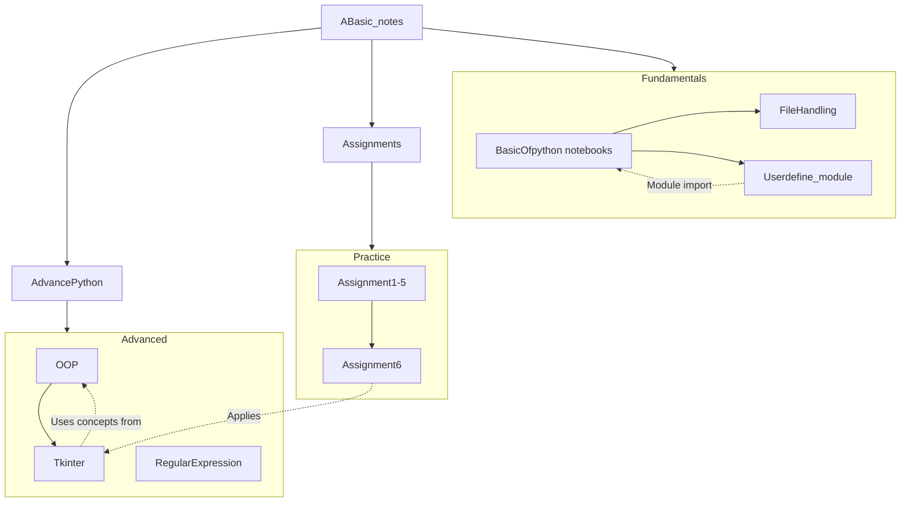

# 🐍 Python Learning Hub

> A comprehensive repository for learning Python from basics to advanced concepts, including practical assignments and hands-on projects.

---

## 📋 Table of Contents

- [Overview](#-overview)
- [Folder Structure](#-folder-structure)
- [Directory Details](#-directory-details)
  - [ABasic_notes](#abasic_notes)
  - [AdvancePython](#advancepython)
  - [Assignments](#assignments)
- [Dependencies & Relationships](#-dependencies--relationships)
- [Getting Started](#-getting-started)
- [Environment Requirements](#-environment-requirements)
- [Best Practices for Contributing](#-best-practices-for-contributing)
- [Workflow Tips](#-workflow-tips)

---

## 📖 Overview

This repository serves as a structured learning path for Python programming. It covers:

- **Fundamentals** – Variables, data types, operators, strings, and control flow
- **Intermediate** – Functions, file handling, and custom modules
- **Advanced** – Object-Oriented Programming, Regular Expressions, and GUI development with Tkinter
- **Practical Exercises** – Assignments to reinforce learning

---

## 📂 Folder Structure

```
📦 Python/
├── 📁 ABasic_notes/                 # Core Python fundamentals
│   ├── 📄 BasicOfpython.ipynb       # Basics Part 1: Literals, variables, keywords
│   ├── 📄 basicOfPython2.ipynb      # Basics Part 2: Data types & type casting
│   ├── 📄 basicOfPython3.ipynb      # Basics Part 3: Strings & I/O operations
│   ├── 📄 basicOfPython4.ipynb      # Basics Part 4: Operators & math
│   ├── 📄 basicOfPython5.ipynb      # Basics Part 5: Control flow statements
│   ├── 📄 basicOfPython6.ipynb      # Basics Part 6: Lists, tuples, dictionaries
│   ├── 📄 basicOfpython7.ipynb      # Basics Part 7: Functions & lambda
│   ├── 📄 BasicOfpython_Notes.md    # Interactive summary notes with quizzes
│   ├── 📁 FileHandling/             # File I/O operations & exercises
│   │   ├── 📄 fileHandling.ipynb    # Comprehensive file handling tutorial
│   │   ├── 📄 demo.txt              # Sample text file for practice
│   │   ├── 📄 practice.txt          # Practice exercise file
│   │   ├── 📄 test.txt              # Test file for experiments
│   │   ├── 📄 user.json             # JSON file handling example
│   │   └── 📄 data.pkl              # Pickle serialization example
│   └── 📁 Userdefine_module/        # Custom Python modules
│       ├── 📄 arithmatic.py         # Arithmetic operations module
│       └── 📄 mycode.py             # Module usage demonstration
│
├── 📁 AdvancePython/                # Advanced Python topics
│   ├── 📁 ObjectOrientedProgramming/
│   │   └── 📄 BasicOfoop.ipynb      # OOP concepts: classes, inheritance, polymorphism
│   ├── 📁 RegularExpression/
│   │   └── 📄 RegularExpression.ipynb # Regex patterns & text processing
│   └── 📁 Tkinter/
│       ├── 📄 tkinter.ipynb         # Tkinter GUI tutorial notebook
│       ├── 📄 Tkinter.md            # Comprehensive Tkinter notes
│       └── 📄 calculator.py         # Calculator GUI application
│
├── 📁 Assignments/                  # Practical exercises
│   ├── 📄 Assignment1.ipynb         # Basic Python exercises
│   ├── 📄 Assignment2.ipynb         # Data types & operators
│   ├── 📄 Assignment3.ipynb         # Control flow problems
│   ├── 📄 Assignment4.ipynb         # Functions & lists
│   ├── 📄 Assignment5.ipynb         # File handling tasks
│   └── 📄 Assignment6.py            # Tkinter calculator project
│
└── 📄 README.md                     # This documentation file
```

---

## 📁 Directory Details

### ABasic_notes

> **Purpose:** Foundation of Python programming with progressive learning materials.

| File | Description |
|------|-------------|
| `BasicOfpython.ipynb` | Introduction to literals, variables, keywords, and basic Python concepts |
| `basicOfPython2.ipynb` | Data types (int, float, str, bool) and type casting/conversion |
| `basicOfPython3.ipynb` | String operations, indexing, slicing, and input/output functions |
| `basicOfPython4.ipynb` | Arithmetic, comparison, logical operators, and operator precedence |
| `basicOfPython5.ipynb` | Conditional statements (if/elif/else) and loops (for/while) |
| `basicOfPython6.ipynb` | Collection data types: lists, tuples, sets, and dictionaries |
| `basicOfpython7.ipynb` | Function definitions, parameters, return values, and lambda expressions |
| `BasicOfpython_Notes.md` | Interactive study guide with quizzes, challenges, and progress tracking |

#### FileHandling (Subdirectory)

> **Purpose:** Learn file operations including reading, writing, and different file formats.

| File | Description |
|------|-------------|
| `fileHandling.ipynb` | Complete tutorial on file I/O: open, read, write, append modes |
| `demo.txt` | Sample text file for basic read/write operations |
| `practice.txt` | Extended practice file with multiple lines |
| `test.txt` | Test file for experimental operations |
| `user.json` | Example JSON file for structured data handling |
| `data.pkl` | Pickle file demonstrating Python object serialization |

#### Userdefine_module (Subdirectory)

> **Purpose:** Learn to create and import custom Python modules.

| File | Description |
|------|-------------|
| `arithmatic.py` | Custom module with functions: `add()`, `sqrt()`, `square()`, `cube()` |
| `mycode.py` | Demonstrates importing and using the `arithmatic` module |

---

### AdvancePython

> **Purpose:** Advanced programming concepts for intermediate to advanced learners.

#### ObjectOrientedProgramming

| File | Description |
|------|-------------|
| `BasicOfoop.ipynb` | OOP fundamentals: classes, objects, inheritance, polymorphism, encapsulation |

#### RegularExpression

| File | Description |
|------|-------------|
| `RegularExpression.ipynb` | Pattern matching, text parsing, and regex operations using `re` module |

#### Tkinter

| File | Description |
|------|-------------|
| `tkinter.ipynb` | Interactive Tkinter tutorial with widget demonstrations |
| `Tkinter.md` | Comprehensive notes covering 12+ topics with code examples and use cases |
| `calculator.py` | Fully functional calculator GUI application using Tkinter |

---

### Assignments

> **Purpose:** Practical exercises to reinforce learning through hands-on coding.

| File | Description | Topics Covered |
|------|-------------|----------------|
| `Assignment1.ipynb` | Introductory exercises | Variables, print statements, basic operations |
| `Assignment2.ipynb` | Data manipulation tasks | Type casting, string operations, arithmetic |
| `Assignment3.ipynb` | Logic building problems | Conditional statements, loops, patterns |
| `Assignment4.ipynb` | Function-based problems | Function creation, list operations |
| `Assignment5.ipynb` | File operations tasks | Reading/writing files, data processing |
| `Assignment6.py` | GUI project | Calculator application using Tkinter |

---

## 🔗 Dependencies & Relationships



### Key Relationships

| Source | Target | Relationship |
|--------|--------|--------------|
| `Userdefine_module/` | `ABasic_notes/` | Custom modules are imported in notebooks |
| `Tkinter/` | `ObjectOrientedProgramming/` | GUI apps use OOP concepts like classes |
| `Assignment6.py` | `Tkinter/` | Applies Tkinter knowledge from tutorials |
| `FileHandling/` | `*.txt`, `*.json`, `*.pkl` | Practice files used by `fileHandling.ipynb` |

---

## 🚀 Getting Started

### 1. Clone or Download

```bash
git clone <repository-url>
cd Python
```

### 2. Recommended Learning Path

```
1️⃣ Start with ABasic_notes/BasicOfpython.ipynb
       ↓
2️⃣ Progress through basicOfPython2-7.ipynb
       ↓
3️⃣ Practice with FileHandling/ and Userdefine_module/
       ↓
4️⃣ Complete Assignments 1-5
       ↓
5️⃣ Move to AdvancePython/ topics
       ↓
6️⃣ Build Assignment6 (Calculator)
```

### 3. Running Notebooks

```bash
# Start Jupyter Notebook
jupyter notebook

# Or use JupyterLab
jupyter lab
```

### 4. Running Python Scripts

```bash
# Run the calculator application
python AdvancePython/Tkinter/calculator.py

# Run Assignment 6
python Assignments/Assignment6.py

# Test custom module
cd ABasic_notes/Userdefine_module
python mycode.py
```

---

## 💻 Environment Requirements

### Prerequisites

| Requirement | Version | Purpose |
|-------------|---------|---------|
| Python | 3.8+ | Core language runtime |
| Jupyter | Latest | Running `.ipynb` notebooks |
| Tkinter | Built-in | GUI applications |

### Installation

```bash
# Verify Python installation
python --version

# Install Jupyter (if not installed)
pip install notebook jupyterlab

# Tkinter is included with Python on Windows
# For Linux: sudo apt-get install python3-tk
```

### Recommended IDE/Editors

- **VS Code** with Python extension
- **PyCharm** Community/Professional
- **Jupyter Notebook/Lab**

---

## 🤝 Best Practices for Contributing

### Code Style

1. **Follow PEP 8** – Use consistent indentation (4 spaces), meaningful variable names
2. **Add Comments** – Explain complex logic and purpose of functions
3. **Use Docstrings** – Document functions and modules

```python
def calculate_area(radius):
    """
    Calculate the area of a circle.
    
    Args:
        radius (float): The radius of the circle
        
    Returns:
        float: The area of the circle
    """
    return 3.14159 * radius ** 2
```

### File Organization

- Place new basic topics in `ABasic_notes/`
- Add advanced topics to appropriate subfolders in `AdvancePython/`
- Name assignment files sequentially: `Assignment7.ipynb`, etc.

### Notebook Guidelines

1. Use **Markdown cells** for explanations
2. Include **code examples** with expected outputs
3. Add **exercises** at the end of each topic
4. Use **clear section headers** for navigation

### Git Workflow

```bash
# Create a feature branch
git checkout -b feature/new-topic

# Make changes and commit
git add .
git commit -m "Add: [Topic Name] tutorial"

# Push changes
git push origin feature/new-topic
```

---

## 💡 Workflow Tips

### Effective Learning Strategies

| Tip | Description |
|-----|-------------|
| 🎯 **Active Coding** | Type out examples instead of copy-pasting |
| 📝 **Take Notes** | Use `BasicOfpython_Notes.md` as a template |
| 🔄 **Spaced Repetition** | Review previous topics before new ones |
| 🧪 **Experiment** | Modify examples to understand behavior |
| ✅ **Complete Assignments** | Practice is key to retention |

### Debugging Tips

```python
# Use print statements for debugging
print(f"Variable value: {variable}")

# Use type() to check data types
print(type(variable))

# Use dir() to explore object methods
print(dir(object))
```

### Quick Reference

```python
# Type conversion
int("42")      # String to integer
str(42)        # Integer to string
float("3.14")  # String to float

# String operations
s = "hello"
s.upper()      # "HELLO"
s[0:3]         # "hel"

# List operations
lst = [1, 2, 3]
lst.append(4)  # [1, 2, 3, 4]
lst.pop()      # Returns 4

# File handling
with open("file.txt", "r") as f:
    content = f.read()
```

---

## 📊 Progress Tracker

Use this checklist to track your learning progress:

### Fundamentals
- [ ] Literals, Variables, Keywords
- [ ] Data Types & Type Casting
- [ ] Strings & I/O Operations
- [ ] Operators & Math
- [ ] Control Flow (if/else, loops)
- [ ] Data Structures (lists, tuples, dictionaries)
- [ ] Functions & Lambda

### Intermediate
- [ ] File Handling
- [ ] Custom Modules
- [ ] Exception Handling

### Advanced
- [ ] Object-Oriented Programming
- [ ] Regular Expressions
- [ ] GUI with Tkinter

### Projects
- [ ] Complete Assignments 1-5
- [ ] Build Calculator App (Assignment 6)

---

## 📞 Support

If you have questions or suggestions:

1. Review the relevant notebook for explanations
2. Check `BasicOfpython_Notes.md` for quick references
3. Experiment with code in a new notebook

---

<div align="center">

**Happy Coding! 🚀**

*"The best way to learn programming is by doing."*

</div>
