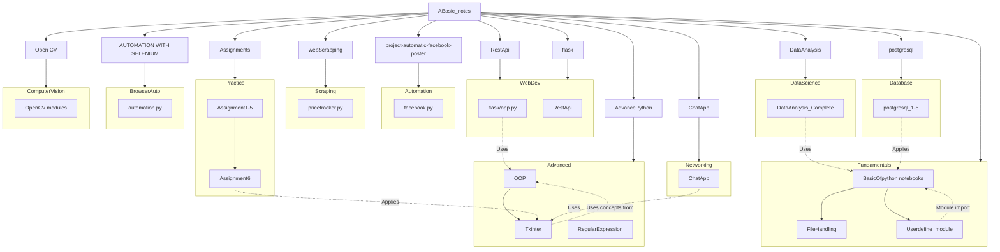

# 🐍 Python Learning Hub

> A comprehensive repository for learning Python from basics to advanced concepts, including practical assignments and hands-on projects.

---

## 📋 Table of Contents

- [Overview](#-overview)
- [Folder Structure](#-folder-structure)
- [Directory Details](#-directory-details)
  - [ABasic_notes](#abasic_notes)
  - [AdvancePython](#advancepython)
  - [Assignments](#assignments)
  - [AUTOMATION WITH SELENIUM](#automation-with-selenium)
  - [ChatApp](#chatapp)
  - [DataAnalysis](#dataanalysis)
  - [Open CV](#open-cv)
  - [postgresql](#postgresql)
  - [RestApi](#restapi)
  - [flask](#flask)
  - [project-automatic-facebook-poster](#project-automatic-facebook-poster)
  - [webScrapping](#webscrapping)
- [Dependencies & Relationships](#-dependencies--relationships)
- [Getting Started](#-getting-started)
- [Environment Requirements](#-environment-requirements)
- [Best Practices for Contributing](#-best-practices-for-contributing)
- [Workflow Tips](#-workflow-tips)

---

## 📖 Overview

This repository serves as a structured learning path for Python programming. It covers:

- **Fundamentals** – Variables, data types, operators, strings, and control flow
- **Intermediate** – Functions, file handling, and custom modules
- **Advanced** – Object-Oriented Programming, Regular Expressions, and GUI development with Tkinter
- **Data Science** – Data analysis with Pandas, NumPy, and visualization libraries
- **Database** – PostgreSQL database connectivity and CRUD operations
- **Web Development** – Full-stack web applications using Flask
- **Automation** – Browser automation with Selenium
- **REST API** – Django REST Framework with blog API project
- **Web Scraping** – Price tracking and data extraction
- **Practical Exercises** – Assignments to reinforce learning

---

## 📂 Folder Structure

```
📦 Python/
├── 📁 ABasic_notes/                 # Core Python fundamentals
│   ├── 📄 BasicOfpython.ipynb       # Basics Part 1: Literals, variables, keywords
│   ├── 📄 basicOfPython2.ipynb      # Basics Part 2: Data types & type casting
│   ├── 📄 basicOfPython3.ipynb      # Basics Part 3: Strings & I/O operations
│   ├── 📄 basicOfPython4.ipynb      # Basics Part 4: Operators & math
│   ├── 📄 basicOfPython5.ipynb      # Basics Part 5: Control flow statements
│   ├── 📄 basicOfPython6.ipynb      # Basics Part 6: Lists, tuples, dictionaries
│   ├── 📄 basicOfpython7.ipynb      # Basics Part 7: Functions & lambda
│   ├── 📄 BasicOfpython_Notes.md    # Interactive summary notes with quizzes
│   ├── 📁 FileHandling/             # File I/O operations & exercises
│   │   ├── 📄 fileHandling.ipynb    # Comprehensive file handling tutorial
│   │   ├── 📄 demo.txt              # Sample text file for practice
│   │   ├── 📄 practice.txt          # Practice exercise file
│   │   ├── 📄 test.txt              # Test file for experiments
│   │   ├── 📄 user.json             # JSON file handling example
│   │   └── 📄 data.pkl              # Pickle serialization example
│   └── 📁 Userdefine_module/        # Custom Python modules
│       ├── 📄 arithmatic.py         # Arithmetic operations module
│       └── 📄 mycode.py             # Module usage demonstration
│
├── 📁 AdvancePython/                # Advanced Python topics
│   ├── 📁 ObjectOrientedProgramming/
│   │   └── 📄 BasicOfoop.ipynb      # OOP concepts: classes, inheritance, polymorphism
│   ├── 📁 RegularExpression/
│   │   └── 📄 RegularExpression.ipynb # Regex patterns & text processing
│   └── 📁 Tkinter/
│       ├── 📄 tkinter.ipynb         # Tkinter GUI tutorial notebook
│       ├── 📄 Tkinter.md            # Comprehensive Tkinter notes
│       └── 📄 calculator.py         # Calculator GUI application
│
├── 📁 Assignments/                  # Practical exercises
│   ├── 📄 Assignment1.ipynb         # Basic Python exercises
│   ├── 📄 Assignment2.ipynb         # Data types & operators
│   ├── 📄 Assignment3.ipynb         # Control flow problems
│   ├── 📄 Assignment4.ipynb         # Functions & lists
│   ├── 📄 Assignment5.ipynb         # File handling tasks
│   └── 📄 Assignment6.py            # Tkinter calculator project
│
├── 📁 AUTOMATION WITH SELENIUM/     # Browser automation tutorials
│   └── 📄 automation.py             # Selenium WebDriver demo script
│
├── 📁 ChatApp/                      # Socket programming project
│   ├── 📄 server.py                 # TCP chat server with threading
│   └── 📄 client.py                 # Tkinter GUI chat client
│
├── 📁 DataAnalysis/                 # Data Science & Analytics
│   └── 📄 DataAnalysis_Complete.ipynb  # Comprehensive data analysis tutorial
│
├── 📁 Open CV/                      # Computer Vision tutorials
│   ├── 📄 01_setup_and_io.py        # Image reading, display, save
│   ├── 📄 02_resize_and_flip.py     # Image resizing and flipping
│   ├── 📄 03_morphology.py          # Erosion and dilation ops
│   ├── 📄 04_draw_transform.py      # Drawing shapes, transformations
│   ├── 📄 05_threshold_and_blur.py  # Thresholding and blur filters
│   ├── 📄 06_edges.py               # Edge detection (Canny)
│   ├── 📄 07_video_io.py            # Video file processing
│   ├── 📄 08_webcam.py              # Webcam capture and display
│   ├── 📄 README.md                 # OpenCV learning guide
│   └── 📄 requirements.txt          # opencv-python, numpy
│
├── 📁 postgresql/                   # Database connectivity
│   ├── 📄 postgresql_1.py           # Database connection basics
│   ├── 📄 postgresql_2.py           # Creating tables
│   ├── 📄 postgresql_3.py           # Inserting data
│   ├── 📄 postgresql_4.py           # Querying & extracting data
│   ├── 📄 postgresql_5.py           # User input to database
│   └── 📁 env/                      # Virtual environment (dependencies)
│
├── 📁 RestApi/                      # Django REST Framework
│   └── 📁 blog/                     # Blog API Project
│       ├── 📄 manage.py             # Django management script
│       ├── 📄 db.sqlite3            # SQLite database
│       ├── 📁 blog/                 # Project settings
│       │   ├── 📄 settings.py       # Django configuration
│       │   ├── 📄 urls.py           # URL routing
│       │   └── 📄 wsgi.py           # WSGI config
│       └── 📁 helloworld/           # Blog app
│           ├── 📄 models.py         # Post model
│           ├── 📄 views.py          # API views
│           ├── 📄 permissions.py    # Custom permissions
│           └── 📄 admin.py          # Admin registration
│
├── 📁 flask/                        # Flask Web Development
│   ├── 📄 app.py                    # Main application (Tutorial)
│   ├── 📄 requirements.txt          # Project dependencies
│   ├── 📁 static/                   # Static files (images, css)
│   └── 📁 template/                 # HTML templates
│
├── 📁 project-automatic-facebook-poster/ # Automation Projects
│   └── 📄 facebook.py               # Selenium automation script
│
├── 📁 webScrapping/                  # Web Scraping Projects
│   └── 📄 pricetracker.py            # Amazon Price Tracker Script
│
└── 📄 README.md                     # This documentation file
```

---

## 📁 Directory Details

### ABasic_notes

> **Purpose:** Foundation of Python programming with progressive learning materials.

| File | Description |
|------|-------------|
| `BasicOfpython.ipynb` | Introduction to literals, variables, keywords, and basic Python concepts |
| `basicOfPython2.ipynb` | Data types (int, float, str, bool) and type casting/conversion |
| `basicOfPython3.ipynb` | String operations, indexing, slicing, and input/output functions |
| `basicOfPython4.ipynb` | Arithmetic, comparison, logical operators, and operator precedence |
| `basicOfPython5.ipynb` | Conditional statements (if/elif/else) and loops (for/while) |
| `basicOfPython6.ipynb` | Collection data types: lists, tuples, sets, and dictionaries |
| `basicOfpython7.ipynb` | Function definitions, parameters, return values, and lambda expressions |
| `BasicOfpython_Notes.md` | Interactive study guide with quizzes, challenges, and progress tracking |

#### FileHandling (Subdirectory)

> **Purpose:** Learn file operations including reading, writing, and different file formats.

| File | Description |
|------|-------------|
| `fileHandling.ipynb` | Complete tutorial on file I/O: open, read, write, append modes |
| `demo.txt` | Sample text file for basic read/write operations |
| `practice.txt` | Extended practice file with multiple lines |
| `test.txt` | Test file for experimental operations |
| `user.json` | Example JSON file for structured data handling |
| `data.pkl` | Pickle file demonstrating Python object serialization |

#### Userdefine_module (Subdirectory)

> **Purpose:** Learn to create and import custom Python modules.

| File | Description |
|------|-------------|
| `arithmatic.py` | Custom module with functions: `add()`, `sqrt()`, `square()`, `cube()` |
| `mycode.py` | Demonstrates importing and using the `arithmatic` module |

---

### AdvancePython

> **Purpose:** Advanced programming concepts for intermediate to advanced learners.

#### ObjectOrientedProgramming

| File | Description |
|------|-------------|
| `BasicOfoop.ipynb` | OOP fundamentals: classes, objects, inheritance, polymorphism, encapsulation |

#### RegularExpression

| File | Description |
|------|-------------|
| `RegularExpression.ipynb` | Pattern matching, text parsing, and regex operations using `re` module |

#### Tkinter

| File | Description |
|------|-------------|
| `tkinter.ipynb` | Interactive Tkinter tutorial with widget demonstrations |
| `Tkinter.md` | Comprehensive notes covering 12+ topics with code examples and use cases |
| `calculator.py` | Fully functional calculator GUI application using Tkinter |

---

### Assignments

> **Purpose:** Practical exercises to reinforce learning through hands-on coding.

| File | Description | Topics Covered |
|------|-------------|----------------|
| `Assignment1.ipynb` | Introductory exercises | Variables, print statements, basic operations |
| `Assignment2.ipynb` | Data manipulation tasks | Type casting, string operations, arithmetic |
| `Assignment3.ipynb` | Logic building problems | Conditional statements, loops, patterns |
| `Assignment4.ipynb` | Function-based problems | Function creation, list operations |
| `Assignment5.ipynb` | File operations tasks | Reading/writing files, data processing |
| `Assignment6.py` | GUI project | Calculator application using Tkinter |

---

### AUTOMATION WITH SELENIUM

> **Purpose:** Learn browser automation and web testing using Selenium WebDriver.

| File | Description |
|------|-------------|
| `automation.py` | Comprehensive Selenium tutorial demonstrating web automation |

**Key Concepts Covered:**

| Concept | Description |
|---------|-------------|
| **WebDriver Setup** | Chrome options, driver initialization |
| **Element Location** | Finding elements by ID, NAME, TAG_NAME, LINK_TEXT |
| **Explicit Waits** | `WebDriverWait` with `expected_conditions` |
| **User Simulation** | Click, type, keyboard actions (`Keys.RETURN`) |
| **Human-like Delays** | Random delays to mimic user behavior |
| **Page Navigation** | URL navigation, title/URL extraction |

**Example Workflow:**
```python
# Initialize driver
driver = webdriver.Chrome(options=options)
wait = WebDriverWait(driver, 15)

# Find and interact with elements
search_box = wait.until(EC.element_to_be_clickable((By.NAME, "q")))
search_box.send_keys("Selenium Python tutorial")
search_box.send_keys(Keys.RETURN)
```

**Running the Script:**
```bash
pip install selenium webdriver-manager
python "AUTOMATION WITH SELENIUM/automation.py"
```

---

### ChatApp

> **Purpose:** Learn network programming with Python sockets and build a real-time chat application with GUI.

| File | Description | Technologies |
|------|-------------|--------------|
| `server.py` | TCP chat server with multi-threading | `socket`, `threading` |
| `client.py` | GUI chat client application | `socket`, `tkinter`, `threading` |

**Architecture:**

```
┌─────────────────┐         ┌─────────────────┐
│   Client GUI    │◄───────►│   Server        │
│   (Tkinter)     │   TCP   │   (Threading)   │
│                 │         │                 │
│ • Send messages │         │ • Listen on port│
│ • Receive msgs  │         │ • Relay messages│
│ • ScrolledText  │         │ • Handle clients│
└─────────────────┘         └─────────────────┘
```

**Key Features:**

| Component | Features |
|-----------|----------|
| **Server** | TCP socket binding, threading for concurrent I/O, message buffering |
| **Client** | Tkinter GUI with ScrolledText, real-time message display, Enter key binding |

**Running the Chat App:**

```bash
# Terminal 1: Start the server
python ChatApp/server.py

# Terminal 2: Start the client
python ChatApp/client.py
```

---

### Open CV

> **Purpose:** Learn computer vision fundamentals with OpenCV through 8 progressive Python scripts.

| File | Topics | Description |
|------|--------|-------------|
| `01_setup_and_io.py` | Topics 1-5 | Reading, displaying, and saving images |
| `02_resize_and_flip.py` | Topics 6, 9-11 | Image resizing and flipping operations |
| `03_morphology.py` | Topics 7-8 | Morphological operations (erosion, dilation) |
| `04_draw_transform.py` | Topics 12-14 | Drawing shapes, image transformations |
| `05_threshold_and_blur.py` | Topics 15-18 | Thresholding and blur filters |
| `06_edges.py` | Topic 19 | Edge detection (Canny) |
| `07_video_io.py` | Topics 20-21 | Video file processing |
| `08_webcam.py` | Topic 22 | Webcam capture and real-time processing |
| `README.md` | — | OpenCV learning guide |
| `requirements.txt` | — | Dependencies: opencv-python, numpy |

**Learning Path:**

```
1️⃣ Image I/O (read, display, save)
       ↓
2️⃣ Basic Operations (resize, flip)
       ↓
3️⃣ Morphology (erosion, dilation)
       ↓
4️⃣ Drawing & Transforms
       ↓
5️⃣ Filters (threshold, blur)
       ↓
6️⃣ Edge Detection
       ↓
7️⃣ Video Processing
       ↓
8️⃣ Webcam Access
```

**Setup & Running:**

```bash
cd "Open CV"
pip install -r requirements.txt
python 01_setup_and_io.py
```

> [!TIP]
> **BGR vs RGB**: OpenCV reads colors as Blue-Green-Red (BGR), not RGB.
> **Exit Windows**: Press 'q' or any key (where specified) to close display windows.

---

### DataAnalysis


> **Purpose:** Learn data science fundamentals including data manipulation, analysis, and visualization.

| File | Description |
|------|-------------|
| `DataAnalysis_Complete.ipynb` | Comprehensive data analysis tutorial covering Pandas, NumPy, data cleaning, manipulation, and visualization techniques |

**Key Topics Covered:**
- 📊 **Pandas** – DataFrames, Series, data loading, filtering, grouping
- 🔢 **NumPy** – Arrays, mathematical operations, statistical functions
- 📈 **Data Visualization** – Matplotlib, Seaborn charts and graphs
- 🧹 **Data Cleaning** – Handling missing values, data transformation
- 📉 **Exploratory Data Analysis (EDA)** – Statistical summaries, correlations

---

### postgresql

> **Purpose:** Learn database connectivity and CRUD operations with PostgreSQL using Python.

| File | Description | Topics Covered |
|------|-------------|----------------|
| `postgresql_1.py` | Database connection | Establishing connection using `psycopg2` |
| `postgresql_2.py` | Table creation | Creating tables with SQL commands |
| `postgresql_3.py` | Data insertion | Inserting records into tables |
| `postgresql_4.py` | Data extraction | Querying data with SELECT statements |
| `postgresql_5.py` | User input handling | Dynamic data insertion from user input |

**Progressive Learning Path:**
```
1️⃣ postgresql_1.py → Connect to database
       ↓
2️⃣ postgresql_2.py → Create employee table
       ↓
3️⃣ postgresql_3.py → Insert sample data
       ↓
4️⃣ postgresql_4.py → Query and fetch data
       ↓
5️⃣ postgresql_5.py → Interactive data entry
```

---

### RestApi

> **Purpose:** Learn REST API development with Django REST Framework (DRF).

This directory contains a complete **Blog API** project built with Django and DRF.

#### Project Structure

| Path | Description |
|------|-------------|
| `blog/manage.py` | Django CLI for running server, migrations, etc. |
| `blog/blog/settings.py` | Project configuration (apps, middleware, database) |
| `blog/blog/urls.py` | URL routing for the API |
| `blog/helloworld/models.py` | `Post` model with title, content, author, timestamps |
| `blog/helloworld/views.py` | API views using DRF generics |
| `blog/helloworld/permissions.py` | Custom permission classes |
| `blog/db.sqlite3` | SQLite database with sample data |

#### Key Topics Covered

| Topic | Description |
|-------|-------------|
| **Models** | Django ORM with `Post` model (ForeignKey to User) |
| **Serializers** | Converting model instances to JSON |
| **Generic Views** | `ListCreateAPIView`, `RetrieveUpdateDestroyAPIView` |
| **Permissions** | `IsAuthenticated`, `IsAuthenticatedOrReadOnly`, Custom `IsAuthorOrReadOnly` |
| **Filtering** | `DjangoFilterBackend`, `SearchFilter`, `OrderingFilter` |
| **Authentication** | Session-based auth with REST framework |

#### API Endpoints

| Endpoint | Method | Description |
|----------|--------|-------------|
| `/hello/` | GET | Welcome message with API info |
| `/post/` | GET | List all posts (with filtering/search) |
| `/post/` | POST | Create new post (auth required) |
| `/post/<id>/` | GET/PUT/DELETE | Retrieve, update, or delete a post |

#### Running the Project

```bash
cd RestApi/blog
python manage.py runserver
# Visit http://127.0.0.1:8000/hello/
```

---

### flask

> **Purpose:** Comprehensive tutorial on building web applications with Flask.

| File | Description | Topics Covered |
|------|-------------|----------------|
| `app.py` | Main Application | Routes, Templates, Forms, File Uploads |
| `template/` | HTML Templates | Jinja2 syntax, Template Inheritance |
| `static/` | Static Assets | Serving images and CSS files |

**Key Topics Covered in `app.py`:**
1. **Introduction & Setup** – Flask instance, configuration
2. **Routing** – Creating views (`/`, `/second`)
3. **Templates** – Rendering HTML (`render_template`)
4. **Forms** – Handling GET & POST requests
5. **Redirection** – `redirect()` and `url_for()`
6. **File Uploads** – Handling file storage
7. **Static Files** – Serving images

---

### project-automatic-facebook-poster

> **Purpose:** Browser automation and scraping using Selenium.

| File | Description |
|------|-------------|
| `facebook.py` | Automated script to login, post updates, and logout from Facebook |

**Features:**
- 🤖 **Selenium WebDriver** – Browser control
- 🔐 **Automated Login** – Handling credentials
- 📝 **Auto-Posting** – Creating and submitting posts
- 🚪 **Clean Logout** – Navigating menus programmatically

---

### webScrapping

> **Purpose:** Web scraping projects for data extraction from websites.

| File | Description | Technologies |
|------|-------------|--------------|
| `pricetracker.py` | Amazon product price tracker | `requests`, `BeautifulSoup` |

#### pricetracker.py

A web scraping script to track Amazon product prices.

**Features:**
- 🏷️ **Product Title Extraction** – Gets product name from Amazon page
- 💰 **Price Tracking** – Extracts current price (handles multiple price formats)
- 🔄 **User-Agent Spoofing** – Mimics browser to avoid blocking
- 📦 **OOP Design** – Clean `PriceTracker` class structure

**Usage:**
```python
from webScrapping.pricetracker import PriceTracker

tracker = PriceTracker("https://www.amazon.in/product-url")
print(tracker.product_title())
print(tracker.product_price())
```

---

## 🔗 Dependencies & Relationships


```mermaid
graph TD
    A[ABasic_notes] --> B[AdvancePython]
    A --> C[Assignments]
    A --> D[DataAnalysis]
    A --> E[postgresql]
    A --> F[RestApi]
    A --> G[flask]
    A --> H[project-automatic-facebook-poster]
    A --> I[webScrapping]
    A --> J[ChatApp]
    A --> K[AUTOMATION WITH SELENIUM]
    A --> L[Open CV]
    
    subgraph Fundamentals
        A1[BasicOfpython notebooks] --> A2[FileHandling]
        A1 --> A3[Userdefine_module]
    end
    
    subgraph Advanced
        B1[OOP] --> B3[Tkinter]
        B2[RegularExpression]
    end
    
    subgraph WebDev
        G1[flask/app.py]
        F1[RestApi]
    end
    
    subgraph Automation
        H1[facebook.py]
    end
    
    subgraph Scraping
        I1[pricetracker.py]
    end
    
    subgraph DataScience
        D1[DataAnalysis_Complete]
    end
    
    subgraph Database
        E1[postgresql_1-5]
    end
    
    subgraph Practice
        C1[Assignment1-5] --> C2[Assignment6]
    end
    
    A --> Fundamentals
    B --> Advanced
    C --> Practice
    D --> DataScience
    E --> Database
    F --> WebDev
    G --> WebDev
    H --> Automation
    I --> Scraping
    J --> Networking
    K --> BrowserAuto
    L --> ComputerVision
    
    A3 -.-> |"Module import"| A1
    B3 -.-> |"Uses concepts from"| B1
    C2 -.-> |"Applies"| B3
    D1 -.-> |"Uses"| A1
    E1 -.-> |"Applies"| A1
    G1 -.-> |"Uses"| B1
    J1 -.-> |"Uses"| B3
    
    subgraph Networking
        J1[ChatApp] 
    end
    
    subgraph BrowserAuto
        K1[automation.py]
    end
    
    subgraph ComputerVision
        L1[OpenCV modules]
    end
```

### Key Relationships

| Source | Target | Relationship |
|--------|--------|--------------|
| `Userdefine_module/` | `ABasic_notes/` | Custom modules are imported in notebooks |
| `Tkinter/` | `ObjectOrientedProgramming/` | GUI apps use OOP concepts like classes |
| `Assignment6.py` | `Tkinter/` | Applies Tkinter knowledge from tutorials |
| `FileHandling/` | `*.txt`, `*.json`, `*.pkl` | Practice files used by `fileHandling.ipynb` |
| `DataAnalysis/` | `ABasic_notes/` | Uses Python fundamentals for data science |
| `postgresql/` | `ABasic_notes/` | Applies Python basics for database operations |
| `ChatApp/client.py` | `Tkinter/` | Uses Tkinter for GUI, threading for async I/O |
| `AUTOMATION WITH SELENIUM/` | `ABasic_notes/` | Applies Python basics with Selenium library |
| `Open CV/` | `ABasic_notes/` | Uses Python fundamentals for image processing |

---

## 🚀 Getting Started

### 1. Clone or Download

```bash
git clone <repository-url>
cd Python
```

### 2. Recommended Learning Path

```
1️⃣ Start with ABasic_notes/BasicOfpython.ipynb
       ↓
2️⃣ Progress through basicOfPython2-7.ipynb
       ↓
3️⃣ Practice with FileHandling/ and Userdefine_module/
       ↓
4️⃣ Complete Assignments 1-5
       ↓
5️⃣ Move to AdvancePython/ topics (OOP, Regex, Tkinter)
       ↓
6️⃣ Build Assignment6 (Calculator)
       ↓
7️⃣ Learn Data Analysis with DataAnalysis/
       ↓
8️⃣ Explore Database operations with postgresql/
       ↓
9️⃣ Build REST APIs with RestApi/blog (Django REST Framework)
       ↓
🔟 Master Web Dev with flask/app.py
       ↓
1️⃣1️⃣ Automate tasks with project-automatic-facebook-poster/
```

### 3. Running Notebooks

```bash
# Start Jupyter Notebook
jupyter notebook

# Or use JupyterLab
jupyter lab
```

### 4. Running Python Scripts

```bash
# Run the calculator application
python AdvancePython/Tkinter/calculator.py

# Run Assignment 6
python Assignments/Assignment6.py

# Test custom module
cd ABasic_notes/Userdefine_module
python mycode.py

# Run PostgreSQL scripts (ensure PostgreSQL is running)
cd postgresql
python postgresql_1.py  # Test connection
python postgresql_5.py  # Interactive data entry
```

---

## 💻 Environment Requirements

### Prerequisites

| Requirement | Version | Purpose |
|-------------|---------|---------|
| Python | 3.8+ | Core language runtime |
| Jupyter | Latest | Running `.ipynb` notebooks |
| Tkinter | Built-in | GUI applications |
| PostgreSQL | 12+ | Database server (for postgresql/) |
| psycopg2 | Latest | PostgreSQL adapter for Python |
| pandas | Latest | Data manipulation (for DataAnalysis/) |
| numpy | Latest | Numerical computing |
| matplotlib | Latest | Data visualization |
| Flask | 2.0+ | Web Framework (for flask/) |
| Django | 4.0+ | Web Framework (for RestApi/) |
| djangorestframework | 3.14+ | REST API toolkit for Django |
| django-filter | Latest | Filtering for DRF |
| Selenium | Latest | Browser Automation (for poster) |
| webdriver-manager | Latest | Browser Driver Management |
| requests | Latest | HTTP requests (for web scraping) |
| beautifulsoup4 | Latest | HTML parsing (for web scraping) |
| opencv-python | Latest | Computer Vision (for Open CV/) |

### Installation

```bash
# Verify Python installation
python --version

# Install Jupyter (if not installed)
pip install notebook jupyterlab

# Tkinter is included with Python on Windows
# For Linux: sudo apt-get install python3-tk

# Install Data Analysis libraries
pip install pandas numpy matplotlib seaborn

# Install PostgreSQL adapter
pip install psycopg2-binary

# For PostgreSQL database:
# Download and install from: https://www.postgresql.org/download/

# Install Flask
pip install flask

# Install Django REST Framework dependencies
pip install django djangorestframework django-filter

# Install Selenium for automation
pip install selenium webdriver-manager

# Install Web Scraping libraries
pip install requests beautifulsoup4

# Install OpenCV for computer vision
pip install opencv-python numpy
```

### Recommended IDE/Editors

- **VS Code** with Python extension
- **PyCharm** Community/Professional
- **Jupyter Notebook/Lab**

---

## 🤝 Best Practices for Contributing

### Code Style

1. **Follow PEP 8** – Use consistent indentation (4 spaces), meaningful variable names
2. **Add Comments** – Explain complex logic and purpose of functions
3. **Use Docstrings** – Document functions and modules

```python
def calculate_area(radius):
    """
    Calculate the area of a circle.
    
    Args:
        radius (float): The radius of the circle
        
    Returns:
        float: The area of the circle
    """
    return 3.14159 * radius ** 2
```

### File Organization

- Place new basic topics in `ABasic_notes/`
- Add advanced topics to appropriate subfolders in `AdvancePython/`
- Name assignment files sequentially: `Assignment7.ipynb`, etc.

### Notebook Guidelines

1. Use **Markdown cells** for explanations
2. Include **code examples** with expected outputs
3. Add **exercises** at the end of each topic
4. Use **clear section headers** for navigation

### Git Workflow

```bash
# Create a feature branch
git checkout -b feature/new-topic

# Make changes and commit
git add .
git commit -m "Add: [Topic Name] tutorial"

# Push changes
git push origin feature/new-topic
```

---

## 💡 Workflow Tips

### Effective Learning Strategies

| Tip | Description |
|-----|-------------|
| 🎯 **Active Coding** | Type out examples instead of copy-pasting |
| 📝 **Take Notes** | Use `BasicOfpython_Notes.md` as a template |
| 🔄 **Spaced Repetition** | Review previous topics before new ones |
| 🧪 **Experiment** | Modify examples to understand behavior |
| ✅ **Complete Assignments** | Practice is key to retention |

### Debugging Tips

```python
# Use print statements for debugging
print(f"Variable value: {variable}")

# Use type() to check data types
print(type(variable))

# Use dir() to explore object methods
print(dir(object))
```

### Quick Reference

```python
# Type conversion
int("42")      # String to integer
str(42)        # Integer to string
float("3.14")  # String to float

# String operations
s = "hello"
s.upper()      # "HELLO"
s[0:3]         # "hel"

# List operations
lst = [1, 2, 3]
lst.append(4)  # [1, 2, 3, 4]
lst.pop()      # Returns 4

# File handling
with open("file.txt", "r") as f:
    content = f.read()
```

---

## 📊 Progress Tracker

Use this checklist to track your learning progress:

### Fundamentals
- [ ] Literals, Variables, Keywords
- [ ] Data Types & Type Casting
- [ ] Strings & I/O Operations
- [ ] Operators & Math
- [ ] Control Flow (if/else, loops)
- [ ] Data Structures (lists, tuples, dictionaries)
- [ ] Functions & Lambda

### Intermediate
- [ ] File Handling
- [ ] Custom Modules
- [ ] Exception Handling

### Advanced
- [ ] Object-Oriented Programming
- [ ] Regular Expressions
- [ ] GUI with Tkinter

### Data Science
- [ ] Pandas DataFrames & Series
- [ ] NumPy Arrays & Operations
- [ ] Data Visualization (Matplotlib/Seaborn)
- [ ] Data Cleaning & Transformation
- [ ] Exploratory Data Analysis

### Database
- [ ] PostgreSQL Connection
- [ ] Table Creation (CREATE)
- [ ] Data Insertion (INSERT)
- [ ] Data Querying (SELECT)
- [ ] User Input to Database

### Web Development
- [ ] Flask Intro & Routing
- [ ] Templates (Jinja2)
- [ ] Forms & Request Handling
- [ ] File Uploads

### Automation
- [ ] Selenium Setup
- [ ] Browser Control
- [ ] Web Elements & Interaction

### REST API (Django)
- [ ] Django Project Setup
- [ ] Models & Migrations
- [ ] Serializers
- [ ] API Views (Generic Views)
- [ ] Permissions & Authentication
- [ ] Filtering & Searching

### Web Scraping
- [ ] HTTP Requests with `requests`
- [ ] HTML Parsing with BeautifulSoup
- [ ] Data Extraction Techniques
- [ ] Price Tracker Implementation

### Computer Vision (OpenCV)
- [ ] Image I/O (read, display, save)
- [ ] Resize and Flip Operations
- [ ] Morphological Operations
- [ ] Drawing and Transformations
- [ ] Thresholding and Blur Filters
- [ ] Edge Detection
- [ ] Video Processing
- [ ] Webcam Access

### Networking (Sockets)
- [ ] TCP Socket Basics
- [ ] Server/Client Architecture
- [ ] Threading for Concurrent I/O
- [ ] GUI Integration with Tkinter

### Projects
- [ ] Complete Assignments 1-5
- [ ] Build Calculator App (Assignment 6)
- [ ] Complete Data Analysis Notebook
- [ ] Build Database-Connected Application
- [ ] Build Blog REST API
- [ ] Build Price Tracker Tool
- [ ] Build Chat Application
- [ ] Complete OpenCV Tutorial Series

---

## 📞 Support

If you have questions or suggestions:

1. Review the relevant notebook for explanations
2. Check `BasicOfpython_Notes.md` for quick references
3. Experiment with code in a new notebook

---

<div align="center">

**Happy Coding! 🚀**

*"The best way to learn programming is by doing."*

</div>
