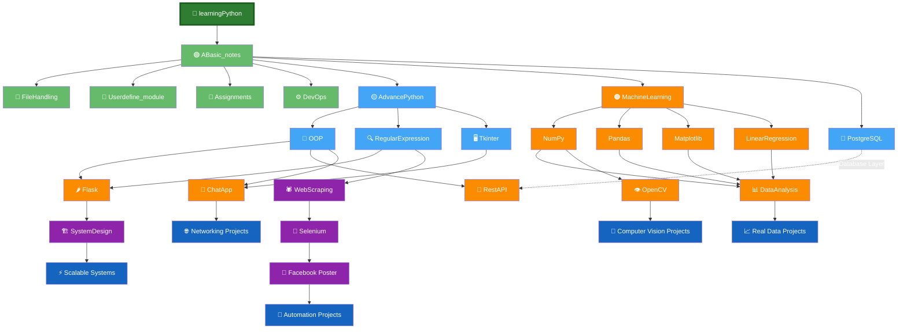

# 🐍 learningPython

> A comprehensive, hands-on Python learning repository — from fundamentals to full-stack projects, machine learning, automation, and system design.


---

## 📋 Table of Contents

- [Overview](#-overview)
- [Project Structure](#-project-structure)
- [Directory Guide](#-directory-guide)
  - [ABasic_notes — Python Fundamentals](#1-abasic_notes--python-fundamentals)
  - [AdvancePython — Advanced Topics](#2-advancepython--advanced-topics)
  - [Assignments — Practice Problems](#3-assignments--practice-problems)
  - [ChatApp — Socket Programming](#4-chatapp--socket-programming)
  - [DataAnalysis — Data Science Notebook](#5-dataanalysis--data-science-notebook)
  - [Dev-ops — Scripting & File I/O](#6-dev-ops--scripting--file-io)
  - [MachineLearning — ML & Visualization](#7-machinelearning--ml--visualization)
  - [Open CV — Computer Vision](#8-open-cv--computer-vision)
  - [flask — Web Development with Flask](#9-flask--web-development-with-flask)
  - [RestApi — Django REST Framework](#10-restapi--django-rest-framework)
  - [SystemDesign — Design Patterns](#11-systemdesign--design-patterns)
  - [postgresql — Database Integration](#12-postgresql--database-integration)
  - [AUTOMATION WITH SELENIUM](#13-automation-with-selenium)
  - [project-automatic-facebook-poster](#14-project-automatic-facebook-poster)
  - [webScrapping — Web Scraping](#15-webscrapping--web-scraping)
- [Dependency Map](#-dependency-map)
- [Getting Started](#-getting-started)
- [Environment Requirements](#-environment-requirements)
- [Recommended Learning Path](#-recommended-learning-path)
- [Contributing](#-contributing)
- [License](#-license)

---

## 📖 Overview

This repository is a structured learning hub for Python, organized into self-contained modules that progressively cover:

| Level | Topics | Directories |
|:------|:-------|:------------|
| 🟢 Beginner | Syntax, Data Types, File I/O, Modules | `ABasic_notes`, `Assignments`, `Dev-ops` |
| 🟡 Intermediate | OOP, Regex, Tkinter GUI, Databases | `AdvancePython`, `postgresql` |
| 🔴 Advanced | Flask, Django REST, Sockets, OpenCV, ML | `flask`, `RestApi`, `ChatApp`, `Open CV`, `MachineLearning` |
| ⚫ Projects | Automation, Scraping, System Design | `AUTOMATION WITH SELENIUM`, `webScrapping`, `project-automatic-facebook-poster`, `SystemDesign` |

---

## 🗂 Project Structure

```
learningPython/
│
├── 📁 ABasic_notes/                     # Python fundamentals (notebooks + notes)
│   ├── BasicOfpython.ipynb              # Variables, data types, basics
│   ├── basicOfPython2.ipynb             # Control flow, loops
│   ├── basicOfPython3.ipynb             # Functions
│   ├── basicOfPython4.ipynb             # Collections (list, dict, set, tuple)
│   ├── basicOfPython5.ipynb             # Comprehensions, lambda
│   ├── basicOfPython6.ipynb             # Exception handling
│   ├── basicOfpython7.ipynb             # Advanced topics
│   ├── BasicOfpython_Notes.md           # Interactive study guide
│   ├── 📁 FileHandling/                 # File I/O examples
│   │   ├── fileHandling.ipynb           # Read/write/append with pickle & JSON
│   │   ├── demo.txt, practice.txt       # Sample text files
│   │   ├── data.pkl                     # Pickled data example
│   │   └── user.json                    # JSON data example
│   └── 📁 Userdefine_module/            # Custom module creation
│       ├── arithmatic.py                # Reusable math functions module
│       └── mycode.py                    # Module import demonstration
│
├── 📁 AdvancePython/                    # Advanced Python concepts
│   ├── 📁 ObjectOrientedProgramming/
│   │   └── BasicOfoop.ipynb             # Classes, inheritance, polymorphism
│   ├── 📁 RegularExpression/
│   │   └── RegularExpression.ipynb      # Regex patterns & matching
│   └── 📁 Tkinter/
│       ├── tkinter.ipynb                # GUI programming guide
│       ├── Tkinter.md                   # Tkinter reference notes
│       └── calculator.py               # Calculator GUI project
│
├── 📁 Assignments/                      # Practice assignments
│   ├── Assignment1.ipynb                # Beginner exercises
│   ├── Assignment2.ipynb                # Data type exercises
│   ├── Assignment3.ipynb                # Loop & function exercises
│   ├── Assignment4.ipynb                # Collection exercises
│   ├── Assignment5.ipynb                # Mixed challenges
│   └── Assignment6.py                   # Standalone script assignment
│
├── 📁 ChatApp/                          # TCP socket chat application
│   ├── server.py                        # Multi-threaded chat server
│   └── client.py                        # Tkinter GUI chat client
│
├── 📁 DataAnalysis/
│   └── DataAnalysis_Complete.ipynb      # Full data analysis walkthrough
│
├── 📁 Dev-ops/                          # Scripting & file I/O exercises
│   ├── grade_checker.py                 # Conditional logic script
│   ├── student_grades.py                # CRUD student management CLI
│   ├── read_file.py                     # File reading example
│   ├── write_file.py                    # File writing example
│   ├── output.txt                       # Output data file
│   └── dev-ops2.pdf                     # Reference material
│
├── 📁 MachineLearning/                  # ML & data visualization
│   ├── NumPy_Notes.ipynb                # NumPy arrays, operations
│   ├── NumPy_Notes.md                   # NumPy reference guide
│   ├── Pandas_Notes.ipynb               # DataFrames, data manipulation
│   ├── Pandas_Notes.md                  # Pandas reference guide
│   ├── Matplotlib_Notes.ipynb           # Plots, charts, visualization
│   ├── Matplotlib_Notes.md              # Matplotlib reference guide
│   └── 📁 LinearReggression/
│       └── LinearRegression.ipynb       # Linear regression implementation
│
├── 📁 Open CV/                          # Computer vision with OpenCV
│   ├── 01_setup_and_io.py               # Image read/display/save
│   ├── 02_resize_and_flip.py            # Resize & flip operations
│   ├── 03_morphology.py                 # Erosion & dilation
│   ├── 04_draw_transform.py             # Drawing shapes, transformations
│   ├── 05_threshold_and_blur.py         # Thresholding & blurring
│   ├── 06_edges.py                      # Edge detection (Canny)
│   ├── 07_video_io.py                   # Video file processing
│   ├── 08_webcam.py                     # Live webcam capture
│   ├── README.md                        # OpenCV learning path guide
│   ├── requirements.txt                 # opencv-python, numpy
│   ├── sample.jpg                       # Input test image
│   └── output.jpg                       # Processed output image
│
├── 📁 flask/                            # Flask web framework tutorial
│   ├── app.py                           # Main Flask app (11 topics covered)
│   ├── requirements.txt                 # Flask >= 2.0.0
│   ├── 📁 template/                     # Jinja2 HTML templates
│   │   ├── base.html                    # Base layout (template inheritance)
│   │   ├── home.html                    # Home page
│   │   ├── index.html                   # Index page (extends base)
│   │   ├── second.html                  # Multi-page navigation demo
│   │   ├── register.html                # Registration form
│   │   ├── confirmation.html            # Registration confirmation
│   │   ├── login.html                   # Login form
│   │   ├── login_success.html           # Login success page
│   │   ├── upload.html                  # File upload form
│   │   └── gallery.html                 # Image gallery viewer
│   └── 📁 static/                       # Static assets (CSS, images)
│       ├── style.css                    # App-wide stylesheet
│       └── 📁 images/                   # Uploaded & static images
│
├── 📁 RestApi/                          # Django REST Framework API
│   └── 📁 blog/                         # Django project root
│       ├── manage.py                    # Django management CLI
│       ├── db.sqlite3                   # SQLite database
│       ├── 📁 blog/                     # Project settings package
│       │   ├── settings.py              # Django configuration
│       │   ├── urls.py                  # Root URL routing
│       │   ├── wsgi.py                  # WSGI entry point
│       │   └── asgi.py                  # ASGI entry point
│       └── 📁 helloworld/              # Blog API app
│           ├── models.py                # Post model (title, content, author)
│           ├── views.py                 # API views (List, Detail, Hello)
│           ├── permissions.py           # Custom IsAuthorOrReadOnly
│           ├── serializers.py           # Model serializers
│           ├── admin.py                 # Admin panel registration
│           └── migrations/              # Database migrations
│
├── 📁 SystemDesign/                     # System design mini-projects
│   ├── README.md                        # Setup & usage guide
│   ├── requirements.txt                 # flask, requests
│   ├── 📁 task1_url_shortener/
│   │   └── app.py                       # URL shortener (Flask + SQLite + Base62)
│   ├── 📁 task2_rate_limiter/
│   │   └── app.py                       # Rate limiter (sliding-window)
│   └── 📁 task3_load_balancer/
│       ├── load_balancer.py             # Round-robin load balancer
│       ├── server1.py                   # Mock backend server (port 5001)
│       ├── server2.py                   # Mock backend server (port 5002)
│       └── server3.py                   # Mock backend server (port 5003)
│
├── 📁 postgresql/                       # PostgreSQL with Python
│   ├── postgresql_1.py                  # Connection setup (psycopg2)
│   ├── postgresql_2.py                  # Creating tables
│   ├── postgresql_3.py                  # CRUD operations
│   ├── postgresql_4.py                  # Advanced queries
│   └── postgresql_5.py                  # Transactions & error handling
│
├── 📁 AUTOMATION WITH SELENIUM/         # Browser automation
│   └── automation.py                    # Google search + navigation demo
│
├── 📁 project-automatic-facebook-poster/ # Facebook auto-poster
│   └── facebook.py                      # Login → Post → Logout (Selenium)
│
├── 📁 webScrapping/                     # Web scraping
│   └── pricetracker.py                  # Amazon price tracker (BeautifulSoup)
│
└── README.md                            # ← You are here
```

---

## 📂 Directory Guide

### 1. `ABasic_notes` — Python Fundamentals

> **Purpose:** Core Python language features taught through Jupyter notebooks with an interactive Markdown study guide.

| File | Description |
|:-----|:------------|
| `BasicOfpython.ipynb` | Variables, literals, keywords, data types |
| `basicOfPython2.ipynb` | Conditionals (`if/elif/else`), loops (`for`, `while`) |
| `basicOfPython3.ipynb` | Functions, `*args`, `**kwargs`, scope |
| `basicOfPython4.ipynb` | Lists, dictionaries, sets, tuples |
| `basicOfPython5.ipynb` | Comprehensions, `lambda`, `map`, `filter` |
| `basicOfPython6.ipynb` | Exception handling (`try/except/finally`) |
| `basicOfpython7.ipynb` | Decorators, generators, advanced patterns |
| `BasicOfpython_Notes.md` | Interactive quiz-style study guide with expandable answers |

**Sub-directories:**

| Directory | Purpose | Key Files |
|:----------|:--------|:----------|
| `FileHandling/` | File I/O operations — text, JSON, pickle | `fileHandling.ipynb`, `user.json`, `data.pkl` |
| `Userdefine_module/` | Creating & importing custom Python modules | `arithmatic.py` (reusable math), `mycode.py` (import demo) |

**Dependencies:** `Userdefine_module/mycode.py` → imports from `arithmatic.py`

---

### 2. `AdvancePython` — Advanced Topics

> **Purpose:** Object-Oriented Programming, Regular Expressions, and GUI development with Tkinter.

| Sub-directory | Purpose | Key Files |
|:--------------|:--------|:----------|
| `ObjectOrientedProgramming/` | Classes, inheritance, encapsulation, polymorphism | `BasicOfoop.ipynb` |
| `RegularExpression/` | Pattern matching with `re` module | `RegularExpression.ipynb` |
| `Tkinter/` | Desktop GUI applications | `tkinter.ipynb`, `calculator.py`, `Tkinter.md` |

**Usage:** The `calculator.py` script is a standalone GUI app — run it directly:
```bash
python AdvancePython/Tkinter/calculator.py
```

---

### 3. `Assignments` — Practice Problems

> **Purpose:** Progressive coding exercises to reinforce concepts from the `ABasic_notes` module.

| File | Topics Covered |
|:-----|:---------------|
| `Assignment1.ipynb` | Variables, I/O, basic operations |
| `Assignment2.ipynb` | Data types, type casting |
| `Assignment3.ipynb` | Loops, functions |
| `Assignment4.ipynb` | Collections (lists, dicts) |
| `Assignment5.ipynb` | Mixed challenges |
| `Assignment6.py` | Standalone Python script exercise |

**Dependencies:** Concepts from `ABasic_notes/` notebooks

---

### 4. `ChatApp` — Socket Programming

> **Purpose:** A real-time TCP chat application demonstrating socket programming and multi-threading.

| File | Description |
|:-----|:------------|
| `server.py` | Multi-threaded TCP server that accepts client connections on port `12345` |
| `client.py` | Tkinter GUI client with scrollable chat window and send button |

**How to Run:**
```bash
# Terminal 1 — Start the server
python ChatApp/server.py

# Terminal 2 — Start the client
python ChatApp/client.py
```

**Dependencies:** Python standard library only (`socket`, `threading`, `tkinter`)

---

### 5. `DataAnalysis` — Data Science Notebook

> **Purpose:** A comprehensive data analysis walkthrough covering data wrangling, exploration, and visualization.

| File | Description |
|:-----|:------------|
| `DataAnalysis_Complete.ipynb` | End-to-end data analysis project (~935 KB with embedded charts) |

**Dependencies:** `numpy`, `pandas`, `matplotlib` (covered in `MachineLearning/`)

---

### 6. `Dev-ops` — Scripting & File I/O

> **Purpose:** Python scripting exercises focused on conditionals, file operations, and basic CRUD logic.

| File | Description |
|:-----|:------------|
| `grade_checker.py` | Score-to-grade converter using `if/elif` |
| `student_grades.py` | Interactive CLI for student grade management (Add/Update/View) |
| `read_file.py` | Read text from `output.txt` |
| `write_file.py` | Write text to `output.txt` |
| `output.txt` | Sample output data |
| `dev-ops2.pdf` | Reference material / notes |

**Dependencies:** `read_file.py` and `write_file.py` read from / write to `output.txt`

---

### 7. `MachineLearning` — ML & Visualization

> **Purpose:** Data science stack fundamentals — NumPy, Pandas, Matplotlib — plus a linear regression implementation.

| File | Description |
|:-----|:------------|
| `NumPy_Notes.ipynb` / `.md` | Array creation, indexing, broadcasting, linear algebra |
| `Pandas_Notes.ipynb` / `.md` | DataFrames, filtering, groupby, merging, cleaning |
| `Matplotlib_Notes.ipynb` / `.md` | Line, bar, scatter, histogram, subplots, styling |
| `LinearReggression/LinearRegression.ipynb` | Supervised ML: linear regression from scratch |

**Setup:**
```bash
pip install numpy pandas matplotlib scikit-learn
```

**Dependencies:** `DataAnalysis/` notebooks rely on the same libraries covered here.

---

### 8. `Open CV` — Computer Vision

> **Purpose:** 8-lesson progressive OpenCV tutorial, from image I/O to live webcam processing.

| File | Topics |
|:-----|:-------|
| `01_setup_and_io.py` | Reading, displaying, saving images |
| `02_resize_and_flip.py` | Resizing and flipping |
| `03_morphology.py` | Erosion and dilation |
| `04_draw_transform.py` | Drawing shapes, affine transformations |
| `05_threshold_and_blur.py` | Thresholding, Gaussian/median blur |
| `06_edges.py` | Canny edge detection |
| `07_video_io.py` | Video file read/write |
| `08_webcam.py` | Live webcam feed with filters |

**Setup:**
```bash
pip install -r "Open CV/requirements.txt"
# Requires: opencv-python >= 4.5.0, numpy >= 1.19.0
```

> **💡 Tip:** Place a `sample.jpg` and `sample.mp4` in the `Open CV/` folder before running the scripts.

---

### 9. `flask` — Web Development with Flask

> **Purpose:** A feature-rich Flask tutorial app covering 11 topics: routing, templates, forms, file uploads, redirects, and static assets.

| Component | Files | Purpose |
|:----------|:------|:--------|
| **App Core** | `app.py` | Main Flask application with all routes |
| **Templates** | `template/*.html` | 10 Jinja2 templates (base layout, forms, gallery) |
| **Styles** | `static/style.css` | Full application stylesheet |
| **Uploads** | `static/images/` | User-uploaded image storage |

**Topics Covered in `app.py`:**
1. Flask introduction & app creation
2. Installing Flask
3. Basic routing (`/`, `/second`, `/index`)
4. Template inheritance (`base.html` → child templates)
5. Registration form (GET/POST)
6. Login form
7. Redirects with `url_for()`
8. File uploads & image gallery

**Setup:**
```bash
pip install -r flask/requirements.txt
python flask/app.py
# Open http://127.0.0.1:5000/
```

**Dependencies:** `template/*.html` → rendered by `app.py`; `static/style.css` → linked from templates

---

### 10. `RestApi` — Django REST Framework

> **Purpose:** A Blog REST API built with Django and Django REST Framework, featuring CRUD operations, authentication, filtering, and custom permissions.

| Component | Key Files | Purpose |
|:----------|:----------|:--------|
| **Django Project** | `blog/blog/settings.py`, `urls.py` | Project configuration & routing |
| **Blog App** | `blog/helloworld/models.py` | `Post` model (title, content, author, timestamps) |
| **API Views** | `blog/helloworld/views.py` | `PostList`, `PostDetail`, `HelloView` endpoints |
| **Permissions** | `blog/helloworld/permissions.py` | `IsAuthorOrReadOnly` custom permission |
| **Database** | `blog/db.sqlite3` | Pre-populated SQLite database |

**API Endpoints:**
| Method | Endpoint | Description |
|:-------|:---------|:------------|
| GET | `/hello/` | Welcome message + API map |
| GET | `/post/` | List all posts (filterable, searchable) |
| POST | `/post/` | Create a new post (auth required) |
| GET/PUT/DELETE | `/post/<id>/` | Retrieve/update/delete a post |

**Setup:**
```bash
cd RestApi/blog
pip install django djangorestframework django-filter
python manage.py runserver
```

---

### 11. `SystemDesign` — Design Patterns

> **Purpose:** Three mini-projects implementing core system design concepts using Python + Flask.

| Task | Concept | Tech Stack |
|:-----|:--------|:-----------|
| `task1_url_shortener/` | URL shortening with Base62 encoding | Flask + SQLite |
| `task2_rate_limiter/` | Sliding-window rate limiting | Flask (in-memory) |
| `task3_load_balancer/` | Round-robin load balancing | Flask + `requests` |

**Setup:**
```bash
pip install -r SystemDesign/requirements.txt
```

**Running the Load Balancer** (requires 4 terminals):
```bash
python SystemDesign/task3_load_balancer/server1.py  # Port 5001
python SystemDesign/task3_load_balancer/server2.py  # Port 5002
python SystemDesign/task3_load_balancer/server3.py  # Port 5003
python SystemDesign/task3_load_balancer/load_balancer.py  # Port 5000
```

---

### 12. `postgresql` — Database Integration

> **Purpose:** Step-by-step guide to PostgreSQL with Python using `psycopg2`.

| File | Topic |
|:-----|:------|
| `postgresql_1.py` | Connection setup |
| `postgresql_2.py` | Creating tables |
| `postgresql_3.py` | CRUD operations |
| `postgresql_4.py` | Advanced queries |
| `postgresql_5.py` | Transactions & error handling |

**Prerequisites:**
- PostgreSQL server running locally on port `5432`
- Database: `postgres`, User: `postgres`

**Setup:**
```bash
pip install psycopg2-binary
```

> ⚠️ **Note:** Update credentials in each file before running. Do not commit real passwords.

---

### 13. `AUTOMATION WITH SELENIUM`

> **Purpose:** Browser automation demo — searches Google, navigates pages, and extracts data with Selenium.

| File | Description |
|:-----|:------------|
| `automation.py` | Automated Google search + page navigation with human-like delays |

**Setup:**
```bash
pip install selenium
# Chrome browser + matching ChromeDriver required
```

---

### 14. `project-automatic-facebook-poster`

> **Purpose:** Automated Facebook posting bot — logs in, creates a post, and logs out using Selenium + Firefox.

| File | Description |
|:-----|:------------|
| `facebook.py` | Full login → post → logout automation flow |

**Setup:**
```bash
pip install selenium webdriver-manager
# Firefox browser required
```

> ⚠️ **Security Warning:** Replace placeholder credentials. Never commit real passwords to version control.

---

### 15. `webScrapping` — Web Scraping

> **Purpose:** Amazon product price tracker using `requests` + `BeautifulSoup`.

| File | Description |
|:-----|:------------|
| `pricetracker.py` | `PriceTracker` class — extracts product title & price from Amazon pages |

**Setup:**
```bash
pip install requests beautifulsoup4
```
## 🔗 Dependency & Connection Map

### 🗺️ Complete Python Learning Ecosystem

The diagram below maps the complete learning journey of this repository, showing how foundational concepts evolve into advanced topics, frameworks, and real-world projects.


```mermaid
graph TD

    ROOT["🐍 learningPython"]

    %% ==========================
    %% FOUNDATION
    %% ==========================

    ROOT --> A["🟢 ABasic_notes"]

    A --> A1["📂 FileHandling"]
    A --> A2["📂 Userdefine_module"]
    A --> B["📝 Assignments"]
    A --> D["⚙️ DevOps"]

    %% ==========================
    %% ADVANCED PYTHON
    %% ==========================

    A --> C["🟡 AdvancePython"]

    C --> C1["🔷 OOP"]
    C --> C2["🔍 RegularExpression"]
    C --> C3["🖥️ Tkinter"]

    %% ==========================
    %% MACHINE LEARNING
    %% ==========================

    A --> E["🟠 MachineLearning"]

    E --> E1["NumPy"]
    E --> E2["Pandas"]
    E --> E3["Matplotlib"]
    E --> E4["LinearRegression"]

    E1 --> J["📊 DataAnalysis"]
    E2 --> J
    E3 --> J
    E4 --> J

    E1 --> K["👁️ OpenCV"]

    %% ==========================
    %% DATABASES
    %% ==========================

    A --> F["🐘 PostgreSQL"]

    %% ==========================
    %% WEB DEVELOPMENT
    %% ==========================

    C1 --> G["🌶️ Flask"]
    C2 --> G

    C1 --> H["🔌 RestAPI"]

    F -. "Database Layer" .-> H

    %% ==========================
    %% NETWORKING
    %% ==========================

    C3 --> I["💬 ChatApp"]
    C1 --> I

    %% ==========================
    %% SYSTEM DESIGN
    %% ==========================

    G --> L["🏗️ SystemDesign"]

    %% ==========================
    %% AUTOMATION & SCRAPING
    %% ==========================

    C2 --> W["🕷️ WebScraping"]

    W --> M["🤖 Selenium"]

    M --> N["📱 Facebook Poster"]

    %% ==========================
    %% REAL-WORLD OUTCOMES
    %% ==========================

    J --> P["📈 Real Data Projects"]

    K --> Q["🎯 Computer Vision Projects"]

    I --> R["🌐 Networking Projects"]

    L --> S["⚡ Scalable Systems"]

    N --> T["🚀 Automation Projects"]

    %% ==========================
    %% STYLING
    %% ==========================

    classDef root fill:#2E7D32,color:#ffffff,stroke:#1B5E20,stroke-width:4px

    classDef beginner fill:#66BB6A,color:#ffffff

    classDef intermediate fill:#42A5F5,color:#ffffff

    classDef advanced fill:#FB8C00,color:#ffffff

    classDef project fill:#8E24AA,color:#ffffff

    classDef outcome fill:#1565C0,color:#ffffff

    class ROOT root

    class A,A1,A2,B,D beginner

    class C,C1,C2,C3,F intermediate

    class E,E1,E2,E3,E4,G,H,I,J,K advanced

    class L,M,N,W project

    class P,Q,R,S,T outcome
```

### Learning Flow

```text
ABasic_notes
│
├── Assignments
├── DevOps
├── AdvancePython
│   ├── OOP
│   │   ├── Flask
│   │   │   └── SystemDesign
│   │   ├── RestAPI
│   │   └── ChatApp
│   │
│   ├── RegularExpression
│   │   ├── Flask
│   │   └── WebScraping
│   │       └── Selenium
│   │           └── Facebook Poster
│   │
│   └── Tkinter
│       └── ChatApp
│
├── MachineLearning
│   ├── NumPy
│   ├── Pandas
│   ├── Matplotlib
│   ├── LinearRegression
│   │
│   ├── DataAnalysis
│   │   └── Real Data Projects
│   │
│   └── OpenCV
│       └── Computer Vision Projects
│
└── PostgreSQL
    └── RestAPI
```

### 📦 Shared Library Matrix

Which Python libraries are used across directories:

| Library | ABasic | Advance | ML | DataAnalysis | OpenCV | Flask | RestApi | SystemDesign | Selenium | WebScrape | PostgreSQL | ChatApp |
|:--------|:------:|:-------:|:--:|:------------:|:------:|:-----:|:-------:|:------------:|:--------:|:---------:|:----------:|:-------:|
| **numpy** | | | ✅ | ✅ | ✅ | | | | | | | |
| **pandas** | | | ✅ | ✅ | | | | | | | | |
| **matplotlib** | | | ✅ | ✅ | | | | | | | | |
| **flask** | | | | | | ✅ | | ✅ | | | | |
| **django** | | | | | | | ✅ | | | | | |
| **selenium** | | | | | | | | | ✅ | | | |
| **requests** | | | | | | | | ✅ | | ✅ | | |
| **beautifulsoup4** | | | | | | | | | | ✅ | | |
| **psycopg2** | | | | | | | | | | | ✅ | |
| **opencv-python** | | | | | ✅ | | | | | | | |
| **tkinter** *(stdlib)* | | ✅ | | | | | | | | | | ✅ |
| **socket** *(stdlib)* | | | | | | | | | | | | ✅ |
| **scikit-learn** | | | ✅ | | | | | | | | | |

| Source Directory | Depends On | Relationship |
|:-----------------|:-----------|:-------------|
| `Assignments` | `ABasic_notes` | Exercises reinforce fundamentals |
| `AdvancePython` | `ABasic_notes` | Builds on basic syntax & data types |
| `DataAnalysis` | `MachineLearning` | Uses NumPy, Pandas, Matplotlib |
| `Open CV` | `MachineLearning` | Uses NumPy for array operations |
| `ChatApp` | `AdvancePython` | Uses OOP + Tkinter from advanced module |
| `flask` | `AdvancePython` | Uses OOP patterns for app structure |
| `RestApi` | `AdvancePython` | Uses OOP for models/views/serializers |
| `SystemDesign` | `flask` | All tasks built with Flask |
| `project-automatic-facebook-poster` | `AUTOMATION WITH SELENIUM` | Same Selenium automation patterns |

---

## 🚀 Getting Started

### 1. Clone the Repository

```bash
git clone https://github.com/Ktripathi2611/learningPython.git
cd learningPython
```

### 2. Create a Virtual Environment (Recommended)

```bash
python -m venv venv

# Windows
venv\Scripts\activate

# macOS / Linux
source venv/bin/activate
```

### 3. Install Dependencies by Module

There is no single global `requirements.txt` — install per-module as needed:

```bash
# For Machine Learning / Data Analysis
pip install numpy pandas matplotlib scikit-learn

# For Flask web app
pip install -r flask/requirements.txt

# For Django REST API
pip install django djangorestframework django-filter

# For OpenCV
pip install -r "Open CV/requirements.txt"

# For System Design projects
pip install -r SystemDesign/requirements.txt

# For Web Scraping
pip install requests beautifulsoup4

# For Selenium Automation
pip install selenium webdriver-manager

# For PostgreSQL
pip install psycopg2-binary
```

### 4. Launch Jupyter (for notebooks)

```bash
pip install jupyter
jupyter notebook
```

---

## ⚙ Environment Requirements

| Requirement | Version | Used By |
|:------------|:--------|:--------|
| **Python** | 3.10+ | All modules |
| **Jupyter Notebook** | Latest | `ABasic_notes`, `AdvancePython`, `Assignments`, `MachineLearning`, `DataAnalysis` |
| **PostgreSQL** | 12+ | `postgresql/` |
| **Chrome + ChromeDriver** | Matching versions | `AUTOMATION WITH SELENIUM` |
| **Firefox + GeckoDriver** | Latest | `project-automatic-facebook-poster` |
| **Webcam** | Any | `Open CV/08_webcam.py` |

---

## 📚 Recommended Learning Path

Follow this path for a structured learning experience:

```
Step 1  →  ABasic_notes/           (Python fundamentals)
Step 2  →  Assignments/            (Practice what you learned)
Step 3  →  AdvancePython/          (OOP, Regex, Tkinter)
Step 4  →  Dev-ops/                (Scripting & file I/O)
Step 5  →  MachineLearning/        (NumPy → Pandas → Matplotlib)
Step 6  →  DataAnalysis/           (Apply ML stack to real data)
Step 7  →  flask/                  (Web development)
Step 8  →  RestApi/                (APIs with Django REST)
Step 9  →  postgresql/             (Database integration)
Step 10 →  SystemDesign/           (Architecture patterns)
Step 11 →  Open CV/                (Computer vision)
Step 12 →  ChatApp/                (Networking & sockets)
Step 13 →  webScrapping/           (Web scraping)
Step 14 →  AUTOMATION WITH SELENIUM/ (Browser automation)
```

---

## 🤝 Contributing

Contributions are welcome! Here's how to get started:

### Guidelines

1. **Fork** the repository and create a feature branch:
   ```bash
   git checkout -b feature/your-feature-name
   ```

2. **Follow the existing structure:**
   - Each topic gets its own directory
   - Include a `requirements.txt` if new dependencies are introduced
   - Use Jupyter notebooks (`.ipynb`) for tutorials with explanations
   - Use `.py` files for standalone scripts and projects
   - Add a `README.md` inside complex directories

3. **Naming conventions:**
   - Directories: `PascalCase` or `snake_case` (match existing style)
   - Python files: `snake_case.py`
   - Notebooks: `descriptive_name.ipynb`

4. **Documentation:**
   - Add docstrings to all functions and classes
   - Include inline comments for non-obvious logic
   - Add Markdown notes (`.md`) alongside notebooks for quick reference

5. **Security:**
   - **Never** commit real credentials, API keys, or passwords
   - Use placeholder values and document what needs to be changed
   - Add sensitive files to `.gitignore`

6. **Testing:**
   - Verify all scripts run without errors
   - Test notebooks from top to bottom (Kernel → Restart & Run All)
   - For Flask/Django apps, confirm all routes respond correctly

### Pull Request Process

1. Ensure your code runs cleanly on Python 3.10+
2. Update this `README.md` if you add new directories
3. Write a clear PR description explaining what you added and why
4. Reference any issues your PR addresses

---

## 📝 License

This project is intended for **educational purposes**. Feel free to use, modify, and share the code for learning.

---

<p align="center">
  <b>Happy Learning! 🚀</b><br>
  <i>Built with ❤️ as a progressive Python learning journey</i>
</p>
