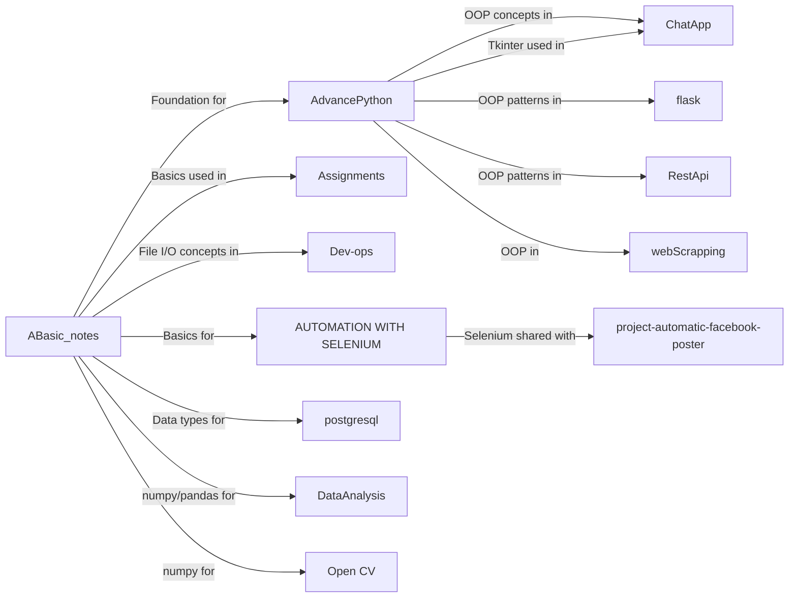

# 🐍 Python Learning Hub

> A comprehensive, hands-on Python learning repository covering everything from basic syntax to full-stack web development, automation, data analysis, and computer vision.

---

## 📑 Table of Contents

- [Overview](#-overview)
- [Folder Structure](#-folder-structure)
- [Directory Documentation](#-directory-documentation)
  - [ABasic\_notes](#1-abasic_notes--python-fundamentals)
  - [AdvancePython](#2-advancepython--advanced-python-concepts)
  - [Assignments](#3-assignments--practice-exercises)
  - [AUTOMATION WITH SELENIUM](#4-automation-with-selenium--browser-automation)
  - [ChatApp](#5-chatapp--socket-based-chat-application)
  - [DataAnalysis](#6-dataanalysis--data-science-with-python)
  - [Dev-ops](#7-dev-ops--devops-fundamentals)
  - [flask](#8-flask--flask-web-framework)
  - [Open CV](#9-open-cv--computer-vision)
  - [postgresql](#10-postgresql--database-programming)
  - [project-automatic-facebook-poster](#11-project-automatic-facebook-poster--social-media-automation)
  - [RestApi](#12-restapi--django-rest-framework)
  - [webScrapping](#13-webscrapping--web-scraping)
- [Dependencies & Environment Setup](#-dependencies--environment-setup)
- [Inter-Directory Dependencies](#-inter-directory-dependencies)
- [Best Practices for Contributing](#-best-practices-for-contributing)
- [License](#-license)

---

## 🌟 Overview

This repository is a structured collection of Python learning materials, projects, and experiments organized by topic. It progresses from beginner fundamentals through advanced concepts and into real-world applications including web development, automation, computer vision, and data analysis.

| Metric | Value |
|---|---|
| **Total Directories** | 13 top-level + nested subdirectories |
| **Topics Covered** | Python basics, OOP, Regex, Tkinter, Flask, Django REST, PostgreSQL, OpenCV, Selenium, Sockets, Data Analysis, Web Scraping |
| **Python Version** | 3.8+ recommended |
| **IDE** | Any (VS Code recommended) |

---

## 📁 Folder Structure

```
python/
├── 📂 ABasic_notes/                    # Python fundamentals & notebooks
│   ├── BasicOfpython.ipynb             # Variables, data types, operators
│   ├── basicOfPython2.ipynb            # Strings, lists, tuples
│   ├── basicOfPython3.ipynb            # Dictionaries, sets
│   ├── basicOfPython4.ipynb            # Control flow (if/else, loops)
│   ├── basicOfPython5.ipynb            # Functions
│   ├── basicOfPython6.ipynb            # List comprehensions, lambda
│   ├── basicOfpython7.ipynb            # Exception handling, modules
│   ├── BasicOfpython_Notes.md          # Quick-reference markdown notes
│   ├── 📂 FileHandling/               # File I/O exercises
│   │   ├── fileHandling.ipynb          # File read/write/append operations
│   │   ├── demo.txt, test.txt          # Sample text files
│   │   ├── practice.txt               # Practice file
│   │   ├── user.json                   # JSON file handling example
│   │   └── data.pkl                    # Pickle serialization example
│   └── 📂 Userdefine_module/          # Custom module creation
│       ├── arithmatic.py               # Arithmetic utility module
│       └── mycode.py                   # Module import demonstration
│
├── 📂 AdvancePython/                   # Advanced Python topics
│   ├── 📂 ObjectOrientedProgramming/
│   │   └── BasicOfoop.ipynb            # Classes, inheritance, polymorphism
│   ├── 📂 RegularExpression/
│   │   └── RegularExpression.ipynb     # Pattern matching with re module
│   └── 📂 Tkinter/
│       ├── tkinter.ipynb               # GUI programming tutorial
│       ├── Tkinter.md                  # Tkinter reference notes
│       └── calculator.py               # GUI calculator project
│
├── 📂 Assignments/                     # Practice assignments
│   ├── Assignment1.ipynb               # Basic Python exercises
│   ├── Assignment2.ipynb               # String & list operations
│   ├── Assignment3.ipynb               # Functions & control flow
│   ├── Assignment4.ipynb               # Data structures
│   ├── Assignment5.ipynb               # Advanced exercises
│   └── Assignment6.py                  # Standalone Python script
│
├── 📂 AUTOMATION WITH SELENIUM/        # Browser automation
│   └── automation.py                   # Google search & navigation bot
│
├── 📂 ChatApp/                         # Network programming
│   ├── server.py                       # TCP socket server
│   └── client.py                       # Tkinter-based chat client
│
├── 📂 DataAnalysis/                    # Data science
│   └── DataAnalysis_Complete.ipynb     # Full data analysis workflow
│
├── 📂 Dev-ops/                         # DevOps fundamentals
│   ├── dev-ops2.pdf                    # DevOps reference material
│   ├── grade_checker.py                # If/elif grade evaluation
│   ├── student_grades.py               # CRUD student grade manager
│   ├── write_file.py                   # File write demo
│   ├── read_file.py                    # File read demo
│   └── output.txt                      # Generated output file
│
├── 📂 flask/                           # Flask web framework
│   ├── app.py                          # Main app (13 topics, 352 lines)
│   ├── requirements.txt                # Flask dependencies
│   ├── 📂 template/                   # Jinja2 HTML templates
│   │   ├── base.html                   # Base layout with inheritance
│   │   ├── home.html                   # Landing page
│   │   ├── index.html                  # Template demo page
│   │   ├── second.html                 # Multi-page navigation demo
│   │   ├── register.html               # Registration form
│   │   ├── confirmation.html           # Form submission confirmation
│   │   ├── login.html                  # Login page
│   │   ├── login_success.html          # Login success message
│   │   ├── gallery.html                # Image gallery page
│   │   └── upload.html                 # File upload page
│   └── 📂 static/                     # Static assets (CSS, images)
│       └── style.css                   # Application stylesheet
│
├── 📂 Open CV/                         # Computer vision
│   ├── 01_setup_and_io.py              # Image I/O basics
│   ├── 02_resize_and_flip.py           # Image transformations
│   ├── 03_morphology.py                # Morphological operations
│   ├── 04_draw_transform.py            # Drawing & transformations
│   ├── 05_threshold_and_blur.py        # Thresholding & blurring
│   ├── 06_edges.py                     # Edge detection (Canny)
│   ├── 07_video_io.py                  # Video file I/O
│   ├── 08_webcam.py                    # Live webcam processing
│   ├── README.md                       # Module-specific docs
│   ├── requirements.txt                # opencv-python, numpy
│   ├── sample.jpg                      # Sample input image
│   └── output.jpg                      # Processed output image
│
├── 📂 postgresql/                      # Database programming
│   ├── postgresql_1.py                 # Connection setup
│   ├── postgresql_2.py                 # Creating tables
│   ├── postgresql_3.py                 # Inserting data
│   ├── postgresql_4.py                 # Queries & updates
│   ├── postgresql_5.py                 # Full CRUD operations
│   └── 📂 env/                        # Virtual environment
│
├── 📂 project-automatic-facebook-poster/ # Social media bot
│   └── facebook.py                     # Auto-login, post & logout
│
├── 📂 RestApi/                         # Django REST Framework
│   └── 📂 blog/                       # Django project root
│       ├── manage.py                   # Django management CLI
│       ├── db.sqlite3                  # SQLite database
│       ├── 📂 blog/                   # Project settings
│       │   ├── settings.py             # Django configuration
│       │   ├── urls.py                 # Root URL routing
│       │   ├── wsgi.py                 # WSGI entry point
│       │   └── asgi.py                 # ASGI entry point
│       └── 📂 helloworld/            # Blog app
│           ├── models.py               # Post model definition
│           ├── views.py                # API views (ListCreate, Detail)
│           ├── serializers.py          # DRF serializers
│           ├── permissions.py          # Custom permissions
│           ├── admin.py                # Admin registration
│           └── 📂 migrations/         # Database migrations
│
├── 📂 webScrapping/                    # Web scraping
│   └── pricetracker.py                 # Amazon price tracker
│
└── README.md                           # This file
```

---

## 📖 Directory Documentation

### 1. `ABasic_notes` — Python Fundamentals

**Purpose:** Core Python learning materials covering syntax, data structures, control flow, functions, and file handling through interactive Jupyter notebooks.

| File | Description |
|---|---|
| `BasicOfpython.ipynb` | Variables, data types, type casting, arithmetic & comparison operators |
| `basicOfPython2.ipynb` | Strings, string methods, lists, list operations, tuples |
| `basicOfPython3.ipynb` | Dictionaries, sets, set operations |
| `basicOfPython4.ipynb` | Conditional statements (`if/elif/else`), `for` and `while` loops |
| `basicOfPython5.ipynb` | Functions, `*args`, `**kwargs`, return values |
| `basicOfPython6.ipynb` | List comprehensions, `lambda`, `map()`, `filter()`, `zip()` |
| `basicOfpython7.ipynb` | Exception handling (`try/except`), built-in modules, `import` |
| `BasicOfpython_Notes.md` | Quick-reference markdown cheat sheet for Python basics |

#### Sub-Directories

| Directory | Purpose | Key Files |
|---|---|---|
| `FileHandling/` | File I/O operations — read, write, append, JSON and pickle | `fileHandling.ipynb`, `user.json`, `data.pkl` |
| `Userdefine_module/` | Creating and importing custom Python modules | `arithmatic.py` (utility module), `mycode.py` (import demo) |

**Usage:** Open notebooks in Jupyter or VS Code. Run cells sequentially.

```bash
pip install jupyter
jupyter notebook ABasic_notes/
```

---

### 2. `AdvancePython` — Advanced Python Concepts

**Purpose:** Intermediate-to-advanced topics including OOP, regular expressions, and GUI development.

| Sub-Directory | Topic | Key Files |
|---|---|---|
| `ObjectOrientedProgramming/` | Classes, objects, inheritance, polymorphism, encapsulation | `BasicOfoop.ipynb` |
| `RegularExpression/` | Pattern matching, `re` module, `findall`, `search`, `sub` | `RegularExpression.ipynb` |
| `Tkinter/` | GUI programming with Tkinter widgets and layout | `tkinter.ipynb`, `calculator.py`, `Tkinter.md` |

**Usage:** Run notebooks for tutorials. Execute `calculator.py` directly for the GUI calculator:

```bash
python AdvancePython/Tkinter/calculator.py
```

---

### 3. `Assignments` — Practice Exercises

**Purpose:** Graded assignments to reinforce Python concepts from basics to advanced topics.

| File | Topics Covered |
|---|---|
| `Assignment1.ipynb` | Basic Python — variables, input/output |
| `Assignment2.ipynb` | Strings and list operations |
| `Assignment3.ipynb` | Functions, loops, and control flow |
| `Assignment4.ipynb` | Data structures — dictionaries, sets |
| `Assignment5.ipynb` | Advanced exercises — file I/O, error handling |
| `Assignment6.py` | Standalone Python script assignment |

---

### 4. `AUTOMATION WITH SELENIUM` — Browser Automation

**Purpose:** Web browser automation using Selenium WebDriver — demonstrates searching Google, navigating pages, and extracting data.

| File | Description |
|---|---|
| `automation.py` | Automated Google search → navigate to example.com → extract heading → click links |

**Dependencies:** `selenium`, Chrome WebDriver

```bash
pip install selenium
# Ensure chromedriver is in PATH or use webdriver-manager
```

---

### 5. `ChatApp` — Socket-Based Chat Application

**Purpose:** A real-time TCP chat application demonstrating Python socket programming and multi-threading with a Tkinter GUI.

| File | Description |
|---|---|
| `server.py` | TCP socket server — listens on port 12345, handles client messages, supports bidirectional communication |
| `client.py` | Tkinter GUI chat client — connects to server, threaded message receiving, send/receive messages |

**Usage:**

```bash
# Terminal 1 — Start the server
python ChatApp/server.py

# Terminal 2 — Start the client
python ChatApp/client.py
```

> **Note:** Both scripts use `socket.gethostbyname(socket.gethostname())` to auto-detect the local IP. Both must run on the same machine or update `HOST` accordingly.

---

### 6. `DataAnalysis` — Data Science with Python

**Purpose:** Comprehensive data analysis workflow using pandas, numpy, matplotlib, and seaborn.

| File | Description |
|---|---|
| `DataAnalysis_Complete.ipynb` | Full data analysis pipeline — loading data, cleaning, transformation, visualization, statistical analysis (~932 KB) |

**Dependencies:** `pandas`, `numpy`, `matplotlib`, `seaborn`

```bash
pip install pandas numpy matplotlib seaborn
```

---

### 7. `Dev-ops` — DevOps Fundamentals

**Purpose:** Python scripting exercises for DevOps — file I/O, conditional logic, and student grade management.

| File | Description |
|---|---|
| `dev-ops2.pdf` | DevOps reference material / course notes |
| `grade_checker.py` | Takes a numeric score input and prints the letter grade (A–F) |
| `student_grades.py` | Interactive CRUD menu — add, update, and display student grades using a dictionary |
| `write_file.py` | Demonstrates basic file writing with `open()` |
| `read_file.py` | Demonstrates basic file reading with `open()` |
| `output.txt` | Sample output file generated by `write_file.py` |

**Dependencies between files:** `read_file.py` reads `output.txt` which is created by `write_file.py`. Run `write_file.py` first.

---

### 8. `flask` — Flask Web Framework

**Purpose:** A comprehensive Flask tutorial application covering 13 topics — from app creation to template inheritance, forms, file uploads, and routing.

| File | Description |
|---|---|
| `app.py` | Main Flask application (352 lines) — covers routing, templates, GET/POST forms, redirects, file uploads, gallery, and login |
| `requirements.txt` | Flask and all required dependencies |

#### Templates (`template/`)

| Template | Purpose |
|---|---|
| `base.html` | Base layout with Jinja2 block inheritance |
| `home.html` | Landing page with navigation |
| `index.html` | Template inheritance demonstration |
| `second.html` | Multi-page navigation demo |
| `register.html` | User registration form (GET/POST) |
| `confirmation.html` | Form submission confirmation |
| `login.html` | User login form |
| `login_success.html` | Successful login page |
| `gallery.html` | Image gallery showcase |
| `upload.html` | File upload interface |

#### Static Assets (`static/`)

| File | Purpose |
|---|---|
| `style.css` | Complete application stylesheet (~14.5 KB) |
| `*.jpg` | Images for gallery demonstration |

**Usage:**

```bash
cd flask
pip install -r requirements.txt
python app.py
# Visit http://127.0.0.1:5000
```

---

### 9. `Open CV` — Computer Vision

**Purpose:** Modular OpenCV learning project with 8 independently runnable scripts covering image/video processing fundamentals.

| File | Description |
|---|---|
| `01_setup_and_io.py` | Image loading, display, and saving |
| `02_resize_and_flip.py` | Resizing, scaling, and flipping images |
| `03_morphology.py` | Erosion, dilation, opening, closing |
| `04_draw_transform.py` | Drawing shapes, text, and affine transformations |
| `05_threshold_and_blur.py` | Binary/adaptive thresholding, Gaussian blur |
| `06_edges.py` | Canny edge detection, Sobel operator |
| `07_video_io.py` | Read and write video files |
| `08_webcam.py` | Live webcam feed with real-time processing |
| `requirements.txt` | `opencv-python`, `numpy` |
| `sample.jpg` | Input sample image |
| `output.jpg` | Processed output image |

**Usage:** Each script is self-contained — press `q` to close display windows:

```bash
cd "Open CV"
pip install -r requirements.txt
python 01_setup_and_io.py
```

---

### 10. `postgresql` — Database Programming

**Purpose:** Progressive PostgreSQL tutorial using `psycopg2` — from connection setup to full CRUD operations.

| File | Description |
|---|---|
| `postgresql_1.py` | Establishing a database connection |
| `postgresql_2.py` | Creating tables |
| `postgresql_3.py` | Inserting data into tables |
| `postgresql_4.py` | Querying and updating data |
| `postgresql_5.py` | Full CRUD — create table, insert user input, extract data |

**Prerequisites:**
1. PostgreSQL server running on `localhost:5432`
2. Database `postgres` accessible with user `postgres`

```bash
pip install psycopg2-binary
# Update password in scripts before running
```

> ⚠️ **Security Note:** Database credentials are hardcoded in scripts. For production, use environment variables.

---

### 11. `project-automatic-facebook-poster` — Social Media Automation

**Purpose:** Selenium-based bot that automates Facebook login, creates a post, and logs out.

| File | Description |
|---|---|
| `facebook.py` | Full automation flow: login → create post → logout (uses Firefox/GeckoDriver) |

**Dependencies:** `selenium`, `webdriver-manager`

```bash
pip install selenium webdriver-manager
# Update FB_EMAIL and FB_PASSWORD before running
```

> ⚠️ **Warning:** This is for educational purposes only. Automating social media may violate terms of service.

---

### 12. `RestApi` — Django REST Framework

**Purpose:** A complete Django REST API blog project covering models, serializers, views, authentication, permissions, pagination, and filtering.

#### Project Structure

| Path | Description |
|---|---|
| `blog/manage.py` | Django CLI management script |
| `blog/db.sqlite3` | SQLite database with sample data |
| `blog/blog/settings.py` | Django settings — installed apps, DRF config, middleware |
| `blog/blog/urls.py` | Root URL configuration |
| `blog/helloworld/models.py` | `Post` model with fields for content, author, timestamps |
| `blog/helloworld/views.py` | API views — `PostList` (list/create), `PostDetail` (retrieve/update/delete) |
| `blog/helloworld/serializers.py` | Model serializers for JSON conversion |
| `blog/helloworld/permissions.py` | Custom permission classes (author-only editing) |
| `blog/helloworld/admin.py` | Django admin registration for Post model |

**Usage:**

```bash
cd RestApi/blog
pip install django djangorestframework
python manage.py runserver
# API available at http://127.0.0.1:8000/
```

---

### 13. `webScrapping` — Web Scraping

**Purpose:** Amazon product price tracker using BeautifulSoup — extracts product titles and prices from Amazon product pages.

| File | Description |
|---|---|
| `pricetracker.py` | `PriceTracker` class — fetches Amazon product page, parses title & price using multiple CSS selectors |

**Dependencies:** `requests`, `beautifulsoup4`

```bash
pip install requests beautifulsoup4
python webScrapping/pricetracker.py
```

---

## 🔗 Dependencies & Environment Setup

### Global Requirements

| Package | Used By | Install |
|---|---|---|
| `jupyter` | ABasic_notes, AdvancePython, Assignments, DataAnalysis | `pip install jupyter` |
| `flask` | flask/ | `pip install flask` |
| `django` | RestApi/ | `pip install django djangorestframework` |
| `opencv-python` | Open CV/ | `pip install opencv-python` |
| `numpy` | Open CV/, DataAnalysis/ | `pip install numpy` |
| `pandas` | DataAnalysis/ | `pip install pandas` |
| `matplotlib` | DataAnalysis/ | `pip install matplotlib` |
| `seaborn` | DataAnalysis/ | `pip install seaborn` |
| `selenium` | AUTOMATION WITH SELENIUM/, project-automatic-facebook-poster/ | `pip install selenium` |
| `webdriver-manager` | project-automatic-facebook-poster/ | `pip install webdriver-manager` |
| `psycopg2-binary` | postgresql/ | `pip install psycopg2-binary` |
| `requests` | webScrapping/ | `pip install requests` |
| `beautifulsoup4` | webScrapping/ | `pip install beautifulsoup4` |

### Quick Install (All Dependencies)

```bash
pip install jupyter flask django djangorestframework opencv-python numpy pandas matplotlib seaborn selenium webdriver-manager psycopg2-binary requests beautifulsoup4
```

### Recommended Setup

```bash
# 1. Clone the repository
git clone <repo-url>
cd python

# 2. Create a virtual environment
python -m venv venv
venv\Scripts\activate   # Windows
# source venv/bin/activate  # macOS/Linux

# 3. Install dependencies
pip install -r requirements.txt  # If a global requirements.txt exists
# Or install per-project:
pip install -r flask/requirements.txt
pip install -r "Open CV/requirements.txt"
```

---

## 🔄 Inter-Directory Dependencies


```mermaid
graph LR
    A[ABasic_notes] -->|Foundation for| B[AdvancePython]
    A -->|Basics used in| C[Assignments]
    B -->|OOP concepts in| D[ChatApp]
    B -->|Tkinter used in| D
    A -->|File I/O concepts in| E[Dev-ops]
    B -->|OOP patterns in| F[flask]
    B -->|OOP patterns in| G[RestApi]
    B -->|OOP in| H[webScrapping]
    A -->|Basics for| I[AUTOMATION WITH SELENIUM]
    I -->|Selenium shared with| J[project-automatic-facebook-poster]
    A -->|Data types for| K[postgresql]
    A -->|numpy/pandas for| L[DataAnalysis]
    A -->|numpy for| M[Open CV]
```

| Source Directory | Depends On | Relationship |
|---|---|---|
| `AdvancePython/` | `ABasic_notes/` | Builds on fundamentals |
| `Assignments/` | `ABasic_notes/` | Exercises test basic concepts |
| `ChatApp/` | `AdvancePython/Tkinter/` | Uses Tkinter for GUI client |
| `Dev-ops/` | `ABasic_notes/FileHandling/` | Applies file I/O concepts |
| `flask/` | `ABasic_notes/`, `AdvancePython/` | Uses functions, OOP, decorators |
| `RestApi/` | `ABasic_notes/`, `AdvancePython/` | Uses OOP, modules, decorators |
| `webScrapping/` | `AdvancePython/` | Uses OOP class design |
| `project-automatic-facebook-poster/` | `AUTOMATION WITH SELENIUM/` | Same Selenium patterns |
| `Open CV/` | `ABasic_notes/` | Uses numpy, file I/O |
| `DataAnalysis/` | `ABasic_notes/` | Uses data structures, numpy |

---

## 🤝 Best Practices for Contributing

### Code Standards

1. **Follow PEP 8** — Use consistent naming, 4-space indentation, and docstrings
2. **One topic per file** — Keep scripts focused and independently runnable
3. **Add comments** — Explain *why*, not just *what*; use inline comments for clarity
4. **Use virtual environments** — Never install packages globally

### Adding New Content

1. **Create a new directory** for each major topic (e.g., `MachineLearning/`)
2. **Include a `requirements.txt`** if new dependencies are introduced
3. **Add a `README.md`** inside the directory explaining setup and usage
4. **Update this root `README.md`** — add entries to the tree diagram and directory docs

### Notebook Guidelines

- Clear all outputs before committing (reduces diff noise)
- Use markdown cells to explain each section
- Number cells logically and run them in order
- Include expected output examples in markdown cells

### Git Workflow

```bash
# Create a feature branch
git checkout -b feature/topic-name

# Stage and commit
git add .
git commit -m "feat: add [topic] tutorial with examples"

# Push and create PR
git push origin feature/topic-name
```

### Commit Message Convention

| Prefix | Usage |
|---|---|
| `feat:` | New tutorials, scripts, or projects |
| `fix:` | Bug fixes in existing code |
| `docs:` | Documentation updates |
| `refactor:` | Code restructuring without behavior change |
| `chore:` | Dependency updates, cleanup |

### Security

- **Never commit credentials** — Use `.env` files or environment variables
- Add sensitive files to `.gitignore`
- Review `postgresql/` scripts and `facebook.py` before sharing

---

## 📄 License

This repository is for **educational purposes**. Feel free to use, modify, and share the code for learning.

---

<p align="center">
  <b>Happy Learning! 🚀</b><br>
  <i>Built with ❤️ as a progressive Python learning journey</i>
</p>
